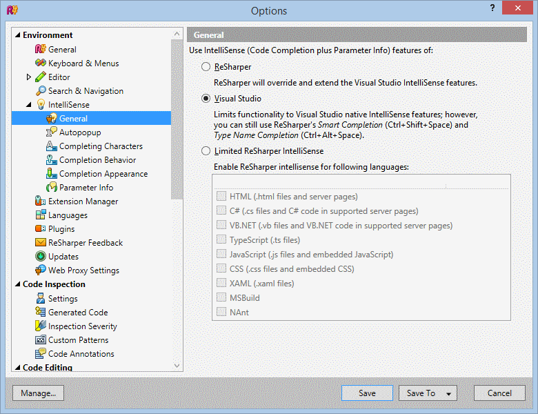
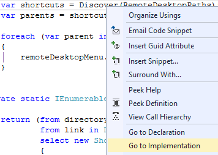
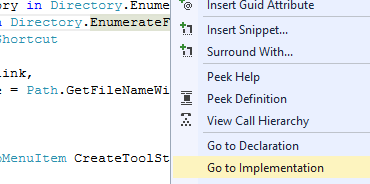
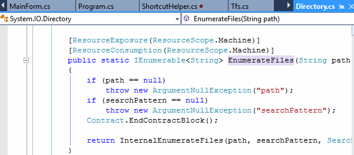
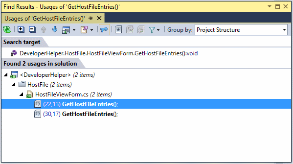
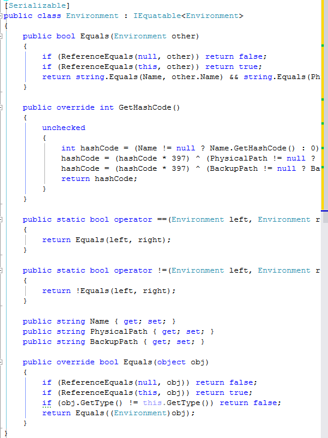
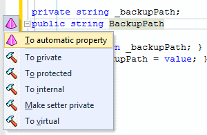
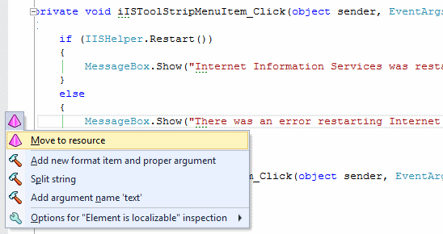
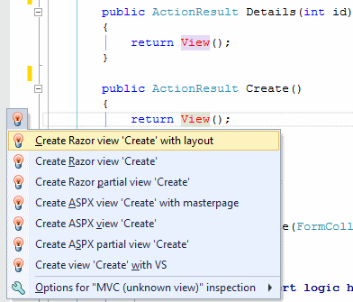

If you know me personally, you'll know how much I love [JetBrains ReSharper](http://www.jetbrains.com/resharper/ 'JetBrains ReSharper'), I use it every day and I swear by it. People often ask me what I like most about it, and here I often stutter. The truth is, there is no one killer reason _why_ I love ReSharper... it's a combination of many small features that make it a tool I literally cannot work without. I'm going to explain my 15 favourite features, and urge you to give it a try. If you're still not sold by the end of this, you're never going to be converted. Note that the reasons are in no particular order, other than the order in which they came to mind. This post was written using Visual Studio 2013 and ReSharper 8.1 (EAP at the time of writing).

**Top tip:** Don't fight with ReSharper, embrace it. If there is a warning/error/configuration that irks you, change the setting! ReSharper is highly configurable and the team at JetBrains have done everything they can to make ReSharper work with you, not against you.

### Common Myths and Moans

First things first... some people have used ReSharper in the past and for whatever reason, they have abandoned it. Usually, they have two main complaints.

**Myth:** ReSharper is slow.

**JP says:** No its not. I have used ReSharper with solutions exceeding 350 projects, with no ill performance affects. Perhaps poor performance was true in earlier versions of ReSharper, but I find this is certainly not true anymore. With the hard work of the JetBrains team, improvements to Visual Studio itself, and increased performance of hardware over the last few years, ReSharper quietly works away in the background and is barely noticeable. If ReSharper is slow for you, you may want to consider getting a new computer. Enough said.

**Moan:** I don't like what ReSharper does to IntelliSense.

**JP says:** Personally, neither do I. ReSharper out of the box turns off Visual Studio IntelliSense and enables its own version. I'm sure it's great and everything, but personally I've never quite been able to get used to it. You can very easily restore the default IntelliSense by clicking **ReSharper > Options > IntelliSense** and select **Visual Studio** on the **General** option screen.



Be sure to restart Visual Studio for the change to take affect properly.

### Convert loops to LINQ expressions and back again

When I was learning all about LINQ expressions, ReSharper helped me greatly. ReSharper has a fantastic feature that rewrites your `for` and `foreach` loops into LINQ expressions. Take the following example;

```csharp
private static IEnumerable<Shortcut> Discover(string root) {
 var list = new List<Shortcut>();

 foreach(string directory in Directory.EnumerateDirectories(root, "*.*", SearchOption.AllDirectories)) {
  foreach(string link in Directory.EnumerateFiles(directory).Where(file => _searchPattern.IsMatch(file))) {
   list.Add(new Shortcut {
    Path = link, FileName = Path.GetFileNameWithoutExtension(link)
   });
  }
 }

 return list;
}
```

The method grabs a list of directories and iterates through them, grabbing each file in each directory and checking the file against predefined criteria. There is nothing _wrong_ with this code, but nested loops and get quite messy and hard to follow, especially if you've also got nested **if statements** (which is very common). With 1 mouse click, the entire method can be refactored to a simple LINQ expression;

```csharp
private static IEnumerable<Shortcut> Discover(string root) {
 return (from directory in Directory.EnumerateDirectories(root, "_._", SearchOption.AllDirectories) from link in Directory.EnumerateFiles(directory).Where(file => _searchPattern.IsMatch(file)) select new Shortcut {
  Path = link, FileName = Path.GetFileNameWithoutExtension(link)
 }).ToList();
}
```

Much easier to read and understand for most people. However, if you find yourself still struggling to get to grips with this style, the same 1 click will refactor the code back to its nested `foreach` loop style. ReSharper will also do its best to add meaningful variable names (and it does a pretty good job).

### ReSharper helps prevent multiple enumerations of IEnumerable collections

More and more these days, applications are written using Object Relational Mappers (ORM) and methods are written against interfaces to improve unit testability and separation of concerns. ReSharper helps you identify performance implications of IEnumerable. Take the following example;

```csharp
IEnumerable<Shortcut> shortcuts = Discover(RemoteDesktopPaths);
if (shortcuts.Any()) {
 var first = shortcuts.First();
 Console.WriteLine(first.FileName);
}
```

Essentially, every time you call **shortcuts**, it is going to be executed. Meaning that, in the case of being mapped to a data store, you will execute the same query repeatedly. Which is probably going to be an expensive operation. ReSharper highlights the problem so that you know to resolve it. (By say, casting IEnumerable to a List).

### To var and back again

A very handy trick when trying to disentangle another developer's <span style="text-decoration:line-through;">questionable</span> code, is the ability to convert a private field to `var` and back again. Take the following example;

```csharp
var shortcuts = Discover(RemoteDesktopPaths);
```

It is not clear by looking at this code what the return type of `Discover` is. Visual Studio's IntelliSense will show you the type if you hover over `var`, but for me this doesn't go far enough. If I put the cursor on `var` and hit **alt-enter**, ReSharper will automatically change `var` to the explicit type. Likewise, if I have an explicit type that I want to change to `var`, I can hit the same keyboard combination.


### Possible 'System.NullReferenceException'

An absolute diamond of a feature that has undoubtedly saved me from a house of pain over the years... ReSharper will identify and highlight code that can and probably will result in a **Null Reference** **Exception**. Granted, its scope is normally limited to a single method, but is still infinitely useful. Take the following example;


Admittedly, the example is contrived, but not uncommon. It's easy to make subtle mistakes like this when writing code. Sometimes you make assumptions that code is always going to be in a particular state, but there is always an edge case where this doesn't hold true ... and believe me, if it exists, the user will find it.

### Go to implementation - Navigating your code



Undoubtedly the most helpful code navigation feature In ReSharper,

**Go to Implemetation**. Unlike

**Go To Definition**, which ships by default with most versions of Visual Studio,

**Go to Implementation** takes you directly to the body of a method even when said method is on an interface.

**Go To Definition** in this scenario will only get you as far as the interface itself, meaning you have to go through and find the actual implementation, which isn't always as easy as it sounds.

**Go to Implementation** is a real time saver.

### Go to implementation - Diving under the covers

**Go to Implementation** takes things one step further. Not only does it greatly simplify navigating your own code, it also allows you to go under the covers and have a look at other, previously inaccessible code. Take, for example, the `EnumerateFiles` method provided by the `Directory` class in `System.IO`. We did not write this method, we cannot (by default) see the code that drives it. The [.NET Framework as you may or may not know is open source](http://referencesource.microsoft.com/ 'Download .NET Framework'), meaning you are free to read it (but not copy the code for your own use). Normally, you would have to go and download the code, extract it, search for the file and open it direct. Very long winded. An alternative approach might be to use a tool like [dotPeek](http://www.jetbrains.com/decompiler/ 'dotPeek') to decompile the assembly and look at the code that way. Again less than ideal.

**Go to Implementation** will automatically identify the assembly, decompile it, and display it in a normal code editor window for you to look at.

Click **Go to Implemenation**:

 After a few seconds, the actual underlying code is presented to you as if it were part of your own project!



### Find Usages

ReSharper has a feature to help find all the usages/references of a method/property/class everywhere in your solution. Granted, Visual Studio also has this feature (Find All Reference's), but ReSharper presents the results in a much more legible and therefore useful way.

**Find all References**;


**Find All Usages**;



As an added win, if there is only one usage of the property/method/class in your solution, ReSharper will automatically navigate to it.

### Redundant Code

One of my biggest (if not biggest) pet peeves when working with a team of other developers is regarding redundant code. Redundant methods, properties, and variables to be precise. Redundant methods are methods that are not called anywhere within the solution, or are unreachable. Normally, these are private methods but the same can hold true for properties and fields. Take the following class;

```csharp
[Serializable]
public class Environment {
 public string Name {
  get;
  set;
 }
 public string PhysicalPath {
  get;
  set;
 }
 public string BackupPath {
  get;
  set;
 }

 private void Save(object obj) {
  using(Stream stream = new FileStream("path.dat", FileMode.CreateNew)) {

   BinaryFormatter formatter = new BinaryFormatter();
   formatter.Serialize(stream, obj);
  }
 }
}
```

The `Save` method is not being used, and it is inaccessible from the outside world. It's basically useles. So in the interest of keeping the code nice and tidy, this method should be deleted. After all, if it were ever needed in the future, it should be in source control! (You should **always** use source control, there is no excuse!) ReSharper indicates to you that this method can be safely removed by dimming the method/property name. You can double check that there are no usages by using the **Find all usages** feature.

### Automatically generate equality members

Undoubtedly a feature that will save you more time (and sanity) than any other, ReSharper can automatically generate all equality checking code in 2 clicks. Take the following class;

```csharp
[Serializable]
public class Environment {
 public string Name {
  get;
  set;
 }
 public string PhysicalPath {
  get;
  set;
 }
 public string BackupPath {
  get;
  set;
 }
}
```

I want to do the following;

* Implement the `IEquatable<T>` interface so that I can have strongly typed equality checking
* Override the standard `Equals` method to check for equality
* Implement the equality operators (!= and ==)
* Override `GetHashCode` (which is practically mandatory when overriding `Equals`)

To use, override `Equals`, set the cursor on the method name, and click **Generate Equality Members**.

 You are then prompted to select the properties/members you want to include, any additional options, and then click **Finish**.



All the code is generated automatically, and you're free to get back to the more interesting stuff.

### Add references to unknown assemblies

Quite often when writing code I find myself needing to add a references to an external assembly that I have not previously referenced. What can I possibly mean by this? Well, take the following example;


I often make use of the **application configuration file** to persist settings in a simple way. To access these settings, I need to use the `ConfigurationManager`. Well, this class lives in **System.Configuration.dll**, which is not referenced by default. Pressing **alt+enter** brings up the ReSharper menu, and hey presto! It _knows_ that I need to add a reference;


To be completely honest, exactly _how_ it knows this I genuinely have no idea, and granted it's a bit hit-and-miss. But when it does know what you're talking about, it's a massive time saver.

### Convert full property to auto property

This is another feature that comes in particularly handy when dealing with legacy code. ReSharper gives you the ability to refactor full properties to auto properties (and back again) simply by pressing **alt-enter**. Take the following example;

```csharp
private string _backupPath;
public string BackupPath {
 get {
  return _backupPath;
 }
 set {
  _backupPath = value;
 }
}
```

It was very common to have code like this before the days of automatic properties. Now this is considered dated, and it's desirable to refactor. But refactoring is time consuming and, quite frankly, boring.



With the end result:

```csharp
public string BackupPath { get; set; }
```

### Move string to resource

It's becoming more and more common for developers to have to take into consideration localization/globalization when developing applications. It's no longer acceptable to write front end code in a single language. ReSharper can help you here. As part of the localization/globalization process, user facing strings have to be extracted to resources (and sometimes resource assemblies) so that they can be translated and the appropriate version displayed to the user in the appropriate language.



ReSharper highlights strings that can be extracted to resources, and gives you the option to move to a resource automatically using the good old **alt+enter** keyboard combination.

### Move to another file to match type name

When developing new functionality (or indeed, updating existing functionality) it's common to create new classes. There are a whole host of shortcuts available within Visual Studio to create these classes for you. A particularly helpful and time saving feature provided by ReSharper is to move your classes to a new file within the same directory with a matching file name. Take the following example;

```csharp
public class Shortcut {
 public Location Location {
  get;
  set;
 }

 public string FileName {
  get;
  set;
 }

 public override string ToString() {
  return Location.Path;
 }

}
public class Location {
 public string Path {
  get;
  set;
 }
}
```

In the interest of not losing my train of thought whilst writing this code, I have added two classes to the same code file. Nothing particularly wrong here, other than it'll potentially make the class harder to find later on (especially by other developers).


ReSharper will pull out the class, create a new code file with the same name, and drop your class in there. Job done.

### Generate views (ASP.NET MVC)

One of my favourite features of ReSharper when developing ASP.NET MVC websites is around the creation of new views/navigating to existing views. Simply create your controller, and any missing views will be highlighted to you. For example;

 You can then use **alt+enter** to create the view, using your favourite layout engine. Or, if the view already exists, you can simply **ctrl+click** on **View** to navigate straight to that view.

### Code Quality Indicator Bar


ReSharper has many built in code analysis tools to detect issues with code. Warnings and errors are highlighted not only on the line that contains the error, but also on a handy overview bar that runs alongside the code editor window itself. I find this particularly helpful when it comes to finding errors. Often when working with large files, it's good to see all the errors in the file as an overview. Errors are highlighted in red, warnings (not build critical) in orange and suggestions/hints in green. Hovering over the icon at the top of the bar reveals the number of warnings/errors and clicking scrolls the editor to the next warning or error.

### Summary

JetBrains ReSharper has a lot of time saving features from; code analysis tools, navigation, refactoring and code generation ... all designed to make you a more efficient developer. Head over to JetBrains right now and get your [free time limited trial](http://www.jetbrains.com/resharper/download/ 'ReSharper Trial'), you won't regret it! I love to hear your feedback, please leave comments below if your enjoyed this post.
