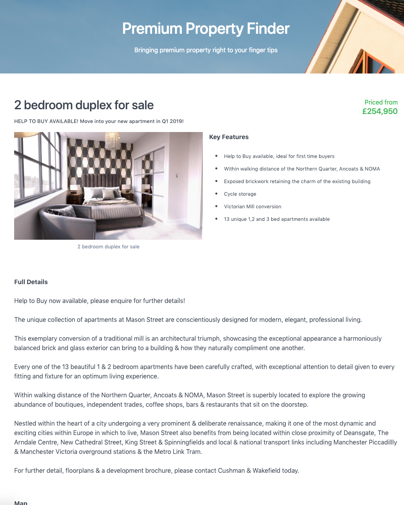
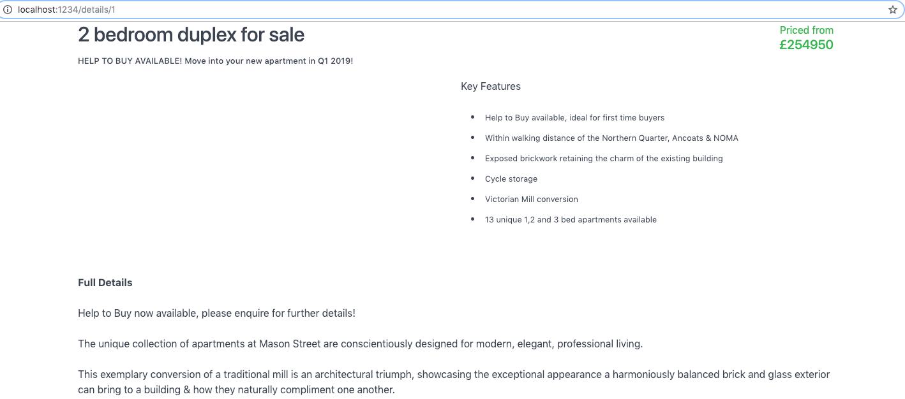

At the beginning of this project, we created two components. Those components were designed to display key information about a single property and its location. These components were `<Map />` and `<KeyFeatures />`.

Currently, these components are hard coded and not very useful. In fact, they show the exact same information for every property. Not useful at all! Let's rectify that.

The single best way to learn anything is repeated exposure. For this post we will not be learning anything new, but instead utilising the skills we have learnt in previous tutorials.

When done, our property details page will go from this;


To this;



Believe it or not, we are 3/4 of the way there, so let's get cracking!

**Note for clarification as this is also a standalone post**. This post is part of a mini-series where we are building a real estate property listing website, complete with routing and advanced forms.

## Removing hard coded property details logic

Open `Details/index.js` and recall that we hard coded `features` for the `<KeyFeatures />` component and we hard coded the address for `<Map />`.

The `Details` page/component should not care about any specific state/data. Instead, the `Details` page should retrieve data from the React Context and pass it to another component where that data should be rendered (recall, this is commonly referred to as the _Container/Presentation_ pattern).

Create a new presentation component called `propertyDetails` inside the `components` folder and create a new file called `index.js`. Add the following logic;

```jsx
import * as React from 'react'
import classnames from 'classnames'

import KeyFeatures from '../keyFeatures'
import Map from '../map'

function PropertyDetails({ listing }) {
  if (!listing) {
    return null
  }

  const { title, address, description, price, features, details } = listing
  const priceClasses = classnames('text-success', 'text-right')

  return (
    <div>
      <div className="columns">
        <div className="column col-9 col-xs-12">
          <h2>{title}</h2>
          <h3 className="text-dark text-small mb-1">{description}</h3>
        </div>
        <div className="column col-3 col-xs-12">
          <h5 className={priceClasses}>
            <small>Priced from</small>
            <br />
            &pound;
            {price}
          </h5>
        </div>
      </div>
      <div className="columns">
        <div className="column col-6 col-xs-12" />
        <div className="column col-6 col-xs-12">
          <KeyFeatures features={features} />
        </div>
      </div>
      <p className="text-bold mt-3">Full Details</p>
      {details.map(detail => (
        <p key={detail}>{detail}</p>
      ))}
      <p className="text-bold mt-3">Map</p>
      <Map address={address} />
    </div>
  )
}

export default PropertyDetails
```

There are a few key differences here to our currently hard coded component. Let's walk through those changes;

- Our new component, `<PropertyDetails />` requires a single prop, `listing`, which must be passed from the `Details` page. This is all the data required to render the page.
- All the details for the property are destructured from `listing` and rendered on the page (we have used some helpful classes from Specture.css to take care of making things look good).
- All features for the property are passed to `<KeyFeatures />`, rather than hard coding this the information has been passed from the 'server'.
- We pass an `address` to the `<Map />`. We will update the `<Map />` component soon to use this address, as currently it is unused.

## How to retrieve a single property/listing

We already know the ID for our property/listing. Observe that when you click on a listing on the home page, the ID for the listing is appended to the URL.

This was achieved because when we configured our router in `src/index.js`, we used a placeholder `:propertyId` to indicate that a variable called `propertyId` was required and that value was not constant but could vary.

```jsx
<Details path="/details/:propertyId" />
```

Our `PropertyListingsProvider` already knows how to fetch data from our 'server', so we can re-use this with a couple of small modifications. We need some way of fetching a _single_ listing rather than all of them.

Open `PropertyListingsProvider.js` and add the following function to `PropertyListingsProvider`;

```javascript
getListingByPropertyId = propertyId => {
  const { propertyListings } = this.state
  return propertyListings.find(listing => listing.id === Number(propertyId))
}
```

This function accepts a `propertyId` as a parameter, and returns the single listing who's ID matches that value.

Now we just need to update the `PropertyListingsContext.Provider` to make this function available to us;

```jsx
<PropertyListingsContext.Provider
  value={{
    allListings: propertyListings,
    propertyListings: filteredListings,
    updateFilter: this.updateFilter,
    getListingByPropertyId: this.getListingByPropertyId
  }}
>
  {children}
</PropertyListingsContext.Provider>
```

Now we can go ahead and update our `Details` page (`Details/index.js`) to call the `getListingsByPropertyId` function with the `propertyId` we get from `@reach/router`, as follows;

```jsx
import * as React from 'react'

import {
  PropertyListingsProvider,
  PropertyListingsConsumer
} from '../../context/PropertyListingsProvider'

import PropertyDetails from '../../components/propertyDetails'

function Details({ propertyId }) {
  return (
    <div className="container">
      <PropertyListingsProvider>
        <PropertyListingsConsumer>
          {({ getListingByPropertyId }) => (
            <PropertyDetails listing={getListingByPropertyId(propertyId)} />
          )}
        </PropertyListingsConsumer>
      </PropertyListingsProvider>
    </div>
  )
}

export default Details
```

Open the `Details` page in your browser and you should see that we have made tremendous progress.



We have two missing features, the image for the listing and the rest of the layout, as we see on the home page.

## Create a simple Gallery component

The 'server' we have created returns us a path to an image for each listing. We can use this path to display an image for the property to the user.

Create a new folder in `components` called `gallery`, and a new file called `index.js`.

Add the following code;

```jsx
import * as React from 'react'

function Gallery({ image, title }) {
  return (
    <figure className="figure">
      
      <figcaption className="figure-caption text-center text-small">{title}</figcaption>
    </figure>
  )
}

export default Gallery
```

Our `<Gallery />` component displays the image, and a caption, both of which need to be supplied via `props`.

Open `propertyDetails/index.js` and look for the empty column where the gallery should live, it will look like this;

```jsx
<div className="column col-6 col-xs-12" />
```

Expand this tag and drop the `<Gallery />` component inside;

```jsx
<div className="column col-6 col-xs-12">
  <Gallery image={image} title={title} />
</div>
```

We are already destructuring `title` from `listing`, so we only need to add the destructure for `image` as follows;

```javascript
const { title, address, description, price, features, details, image } = listing
```

And remember to add an `import` for `<Gallery />` as follows;

```javascript
import Gallery from '../gallery'
```

The image for the property should now be visible.

## Finalising the layout

Our page is missing the `<Hero />` banner, so let's correct that. Open `Details/index.js` and import the `<Hero />` component;

```javascript
import Hero from '../../components/hero'
```

Then place the `<Hero />` component directly above our container `div`;

```jsx
function Details({ propertyId }) {
  return (
    <React.Fragment>
      <Hero />
      <div className="container">
        {
          // ...
        }
      </div>
    </React.Fragment>
  )
}
```

### Small details

Feel free to skip this part, as the layout for the page is now basically complete. However, there are a couple of small refinements we can make to make the UI a bit more attractive.

Open `<Hero />` and update as follows;

```jsx
import * as React from 'react'
import classnames from 'classnames'

import styles from './styles.module.css'

function Hero({ miniHero }) {
  const classes = classnames(styles.hero, 'hero', 'mb-3', {
    'hero-sm': miniHero,
    [styles.miniHero]: miniHero,
    'hero-lg': !miniHero
  })

  return (
    <div className={classes}>
      <div className="hero-body text-center text-light">
        <h1>Premium Property Finder</h1>
        <p className="mb-0">Bringing premium property right to your fingertips</p>
      </div>
    </div>
  )
}

export default Hero
```

We are accepting `miniHero` as a `prop`. This `prop` applies a CSS class to shrink the hero banner down so it does not dominate the page as much.

Create a new file in the same directory called `styles.module.css` and add the following styling;

```css
.hero {
  background-image: url('../../images/hero.jpg');
  background-repeat: no-repeat;
  background-size: cover;
  background-attachment: scroll;
}

@media screen and (min-width: 992px) {
  .miniHero {
    background-position-y: -150px;
  }
}
```

Finally we need to pass `miniHero` to our `<Hero />` component in `Details/index.js` as follows;

```jsx
<Hero miniHero />
```

That should take care of the visual appearance of the `<Hero />` banner.

## Summary

Congratulations! You made it to the end! This has been a comprehensive course where we have covered most of the important concepts of creating a React based property listings website. In this series you have learnt how to get started quickly, how to use build tooling (Parcel.js), how to work with forms, how to use React Context API, and so much more. I hope you enjoyed it and more importantly, I hope you take the knowledge gained and apply it to your projects going forward.
