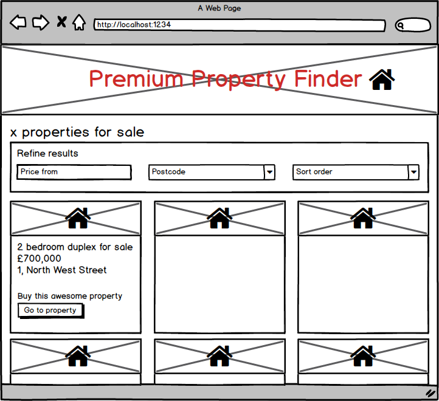
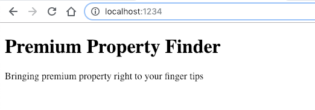
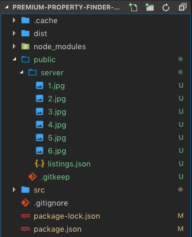
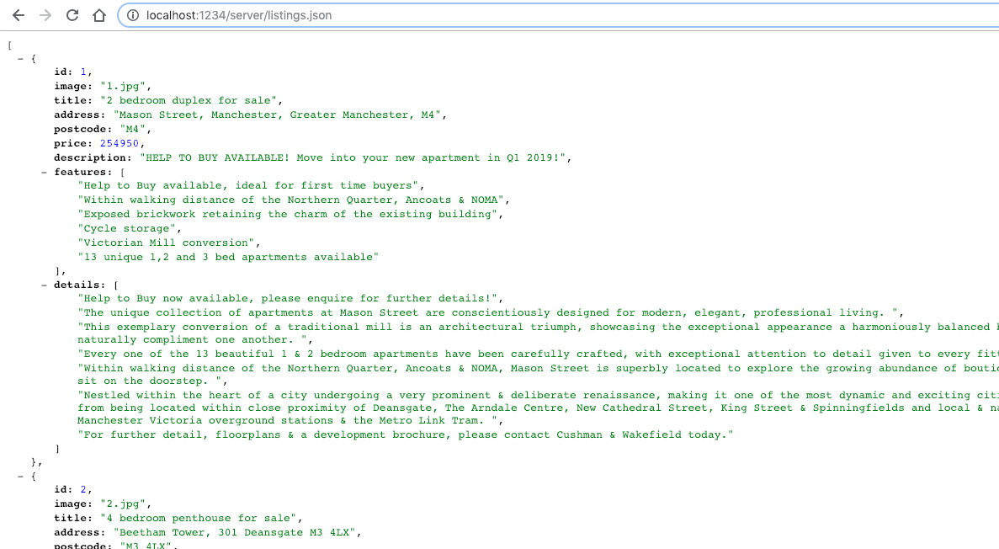
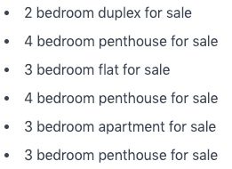
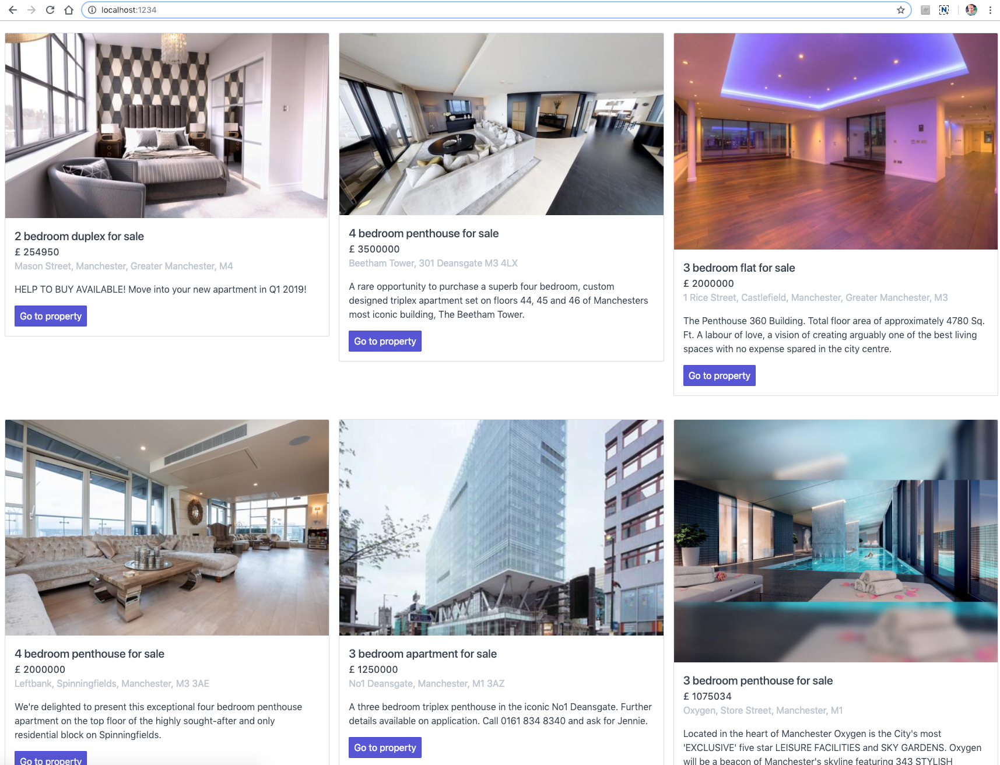
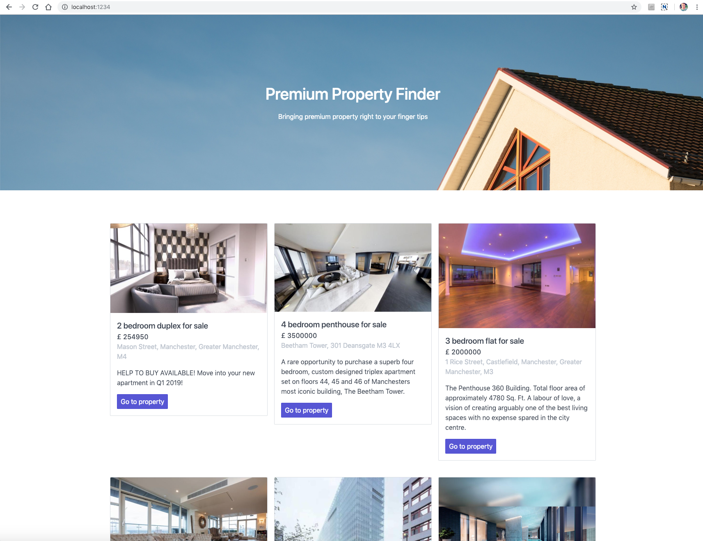

As promised, we will now get down to business and really start fleshing out our home page. This post is all about getting our hands dirty by spending time building components, getting our business logic in place, and generally getting some hands-on experience. The approach taken to building out a React application is the same approach you may take when building a real-world production ready application.

Take your time, get a good cup of [Earl Grey tea](https://amzn.to/2Rl0i8d), this is going to be a long one.

**Note for clarification as this is also a standalone post**. This post is part of a mini-series where we are building a real estate property listing website, complete with routing and advanced forms.

## Building out our React home page

We need some more information about the layout. Regrettably, the UX designer is on holiday... but thankfully the CTO read an article about design 4 years ago so they have stepped in and provided a rough mock for reference;



The CTO has not mentioned styling (only layout), because they know we use [Spectre.css](https://picturepan2.github.io/spectre/) for everything are happy to proceed with the default styling (makes our life easier!).

Looking at the mock, we can identify several components;

- Hero. The banner along the top consisting of a background image and some text
- Filter ('Refine results'). The CTO wants us to add the ability for the user to quickly refine and sort their results
- Listing. A list of properties. Each property is a _card_, which contains high level information about the property (description, price, etc).

We may need more components, which we will add as we go along, this is just a starting point.

## How to build a hero component in React.js

The hero component is, in our case, a large image with text within that promotes our brand and adds design flare to the page.

Go to `src/components`, create a new folder called `Hero`, and a new file called `index.js`. Add the following code;

```javascript
import * as React from 'react'

function Hero() {
  return (
    <div>
      <div>
        <h1>Premium Property Finder</h1>
        <p>Bringing premium property right to your fingertips</p>
      </div>
    </div>
  )
}

export default Hero
```

We have extra `<div />` tags because we are going to use one of them to position the hero image as a background image using CSS classes. We could have used an `` tag here but that would have involved a lot of `position:absolute` type positioning code to get it all to line up properly on mobile and desktop.

We will come back to this momentarily. First, let's use our `<Hero />` component so we can see it working in the browser.

Open `src/pages/Home/index.js` and update the code as follows;

```javascript
import * as React from 'react'

import Hero from '../../components/hero'

function Home() {
  return <Hero />
}

export default Home
```

Here we import the `<Hero />` component and display it on the home page. If you refresh your browser now, you should see the hero;



We _really_ need some styling.

## How to add Spectre.css to your project

Thankfully, adding Spectre.css is very easy, in part due to the simplicity of Parcel.js.

First, install Spectre.css;

```shell
npm install --save spectre.css
```

Then open your `index.html` file add add a `<link />` tag to the header;

```html
<link rel="stylesheet" href="../node_modules/spectre.css/dist/spectre.css" />
```

Parcel.js will take care of importing the file for us.


You should notice a subtle difference, as Spectre.css changes the default font families and colours with no additional code changes needed.

Back to our Hero banner.

Update your `<Hero />` component as follows;

```jsx
function Hero() {
  return (
    <div className="hero hero-lg mb-3">
      <div className="hero-body text-center text-light">
        <h1>Premium Property Finder</h1>
        <p className="mb-0">Bringing premium property right to your fingertips</p>
      </div>
    </div>
  )
}
```

We have added some classes here;

- Hero specific classes (Spectre.css has a built-in hero) - `hero hero-lg hero-body`
- Text alignment and styling classes `text-center text-light`
- Custom spacing classes that we will define next.

Spectre.css has some classes built in for adding space (or removing it) between elements. The spacing is not quite right for our needs so we will add some advanced SCSS to override it with some custom values. (We will do this next).

First, let's set a nice background image. If you need a [background image, you can use this one on GitHub](https://github.com/jpreecedev/premium-property-finder/blob/master/src/images/hero.jpg). Take your image and place it in a new folder inside `src` called `images`.

In the same folder as your `<Hero />` component, create a new file called `styles.module.css` and add the following;

```css
.hero {
  background-image: url('../../images/hero.jpg');
  background-repeat: no-repeat;
  background-attachment: scroll;
  background-size: cover;
}

@media screen and (min-width: 992px) {
  .miniHero {
    background-position-y: -150px;
  }
}
```

And import the file into `Hero/index.js` as follows;

```javascript
import styles from './styles.module.css'
```

Finally, we need to use the hero CSS class we just defined.

## How to use the classnames npm package

We have two options now for using our CSS modules class.

We could update the code as follows;

```jsx
{/* This */}
<div className="hero hero-lg mb-3"></div>

{/* Could become this */}
<div className="{`${styles.hero}" hero hero-lg mb-3`}></div>
```

That will definitely work and our background image will display.

However, over time you will likely add more and more classes, and some of those classes will get applied conditionally depending on _factors_ (which we will encounter later).

To help manage and prevent a potential ternary operator nightmare further down the road, there is a useful and popular package on NPM called `classnames`.

`classnames` enables us to write code as follows;

```javascript
// Always add .hero from styles.module.css
const classes = classnames('hero', 'hero-lg', 'mb-3', styles.hero)

// Only add the .hero class when some condition is true
const classes = classnames('hero', 'hero-lg', 'mb-3', {
  [styles.hero]: conditional
})
```

This is a useful and tidy syntax that we will utilise several times.

Add `classnames` to your project;

```shell
npm install --save classnames
```

And import it into `hero/index.js`;

```javascript
import classnames from 'classnames'
```


The `<Hero />` component should now be displayed and working properly.

## How to serve static data using Parcel.js development server

We have not spoken at all about the server at any point in this mini-series, that is because we do not have a server and it would be a lot of work to get a server up and running (an entire course in itself).

However, we will go ahead and write our code _almost as if_ it was coming from a real endpoint. Thankfully, the Pacel.js development server again makes this easy for us.

At the root level of your project (in the `premium-property-finder` folder, the same level as the `src` folder), create a new folder called `public`, and a new folder within called `server`.

Next, [download all the listing data and images from GitHub](https://github.com/jpreecedev/premium-property-finder/tree/master/public/server), and copy those files into the `server` folder you just created.



Your project should now look like the screenshot shown above, consisting of several images and a `listings.json` file.

Finally, we simply need to tell Parcel.js about the folder we just created.

Go to your `package.json` file and add the `staticPath` key and value as shown at the bottom of this code snippet;

```json
{
  "name": "premium-property-finder",
  "version": "1.0.0",
  "description": "",
  "main": "src/index.js",
  "scripts": {
    // ...
  },
  "devDependencies": {
    // ...
  },
  "dependencies": {
    // ...
  },
  // ...
  "staticPath": "public"
  // ...
}
```

Then install the `parcel-plugin-static-files-copy` plugin as follows (no further configuration of this package is needed);

```shell
npm install --save-dev parcel-plugin-static-files-copy
```

You need to restart Parcel at this point for the change to take effect.

Open your web browser to `http://localhost:123/server/listings.json` and peruse the data to gain a basic level of familiarity with it.



We will use this information to build our listings and details pages.

## Fetching data using React Context API

When developing React web applications, I strive to follow these basic rules;

- Code in line with the [SOLID principals](https://en.wikipedia.org/wiki/SOLID) to make my code reusable, extensible and maintainable
- Keep components tidy and compact (<100-150 lines typically)
- Use the right tools for the job

We need to fetch some data from the server and use that data to render our view. Later on, we will also want to manipulate that data in to some different shape (remember the filter?). React Context API will keep the logic for this behaviour encapsulated and in one place so it can be reused in several other places, and it enables our application to be dynamically updated with no page refreshes!

The React Context API was dramatically revised and updated as part of the 16.3 release of React, so you will need to be using at least that version for the following to apply.

### React Context API overview

The React Context API (referred to from now on simply as Context API) consists of a **Provider** and a **Consumer**.

The **Provider** makes _state_ and _functions which update state_ available to your components. A **Consumer** is what you use to get access to those properties inside your components.

In your code, you wrap the Context API Provider in a `class`, which uses local state. When that state changes, your component will automatically re-render to reflect the changes (assuming a re-render is required, as React is smart about this).

### How to get started with Context API

Start by creating a new folder in `src` called `context`, and create a new file called `PropertyListingsProvider.js`.

Create a new _context_, and a _consumer_, as follows;

```javascript
import * as React from 'react'

const DefaultState = {
  propertyListings: []
}

const PropertyListingsContext = React.createContext(DefaultState)

export const PropertyListingsConsumer = PropertyListingsContext.Consumer
```

`PropertyListingsContext` is the context, which is initialised with a default state object. We cannot use the context as-is, so we do not export it yet. The consumer on the other hand is fine to export as-is, because it will work automatically when wrapped inside the provider (we will see this shortly).

Define the provider as follows (in the same file);

```jsx
export class PropertyListingsProvider extends React.Component {
  state = DefaultState

  componentDidMount() {
    fetch('/server/listings.json')
      .then(res => res.json())
      .then(res => {
        this.setState({ propertyListings: res })
      })
  }

  render() {
    const { children } = this.props
    const { propertyListings } = this.state

    return (
      <PropertyListingsContext.Provider
        value={{
          propertyListings
        }}
      >
        {children}
      </PropertyListingsContext.Provider>
    )
  }
}
```

I have included quite a bit of code here, so let's talk about it step-by-step;

- First, we define a `class` that inherits from `React.Component`. This is required because we need to use local state.
- Then we set the default state on the class to the same default state we used when we initialised our context earlier. I am not sure this is strictly necessary but I believe it will prevent unnecessary re-render's when the provider is initialised.
- In the `render` function, we return a `Provider` object, which has a `value`. We pass our property listings to the `Provider` so that we can consume them later
- We render `children` inside the `Provider`. This means that we can wrap the provider around other elements and components and not break our application.
- We take care of fetching data from the server in `componentDidMount`, and store the results in the local state. This operation only happens once.

### How to consume data from React Context API

We have now set ourselves up for success. We have a provider that contains all the information about our listings, now we need to consume that data in one of our components.

We cannot use the `Consumer` by itself, in order for the `Consumer` to work, we must have a `Provider` in the same tree. The `Provider` must be in the same tree as the `Consumer`. The `Provider` will often live at the root level of a _page_.

Open `home/index.js` and import both the `PropertyListingsProvider` and `PropertyListingsConsumer` objects;

```javascript
import {
  PropertyListingsProvider,
  PropertyListingsConsumer
} from '../../context/PropertyListingsProvider'
```

Now, update your `<Home />` component as follows;

```jsx
function Home() {
  return (
    <React.Fragment>
      <Hero />
      <div className="container">
        <PropertyListingsProvider />
      </div>
    </React.Fragment>
  )
}
```

We have a provider, now we need a consumer, so we can start displaying information about each listing.

Add the following code inside `<PropertyListingsProvider />`;

```jsx
<PropertyListingsConsumer>
  {({ propertyListings }) => (
    <ul>
      {propertyListings.map(listing => (
        <li>{listing.title}</li>
      ))}
    </ul>
  )}
</PropertyListingsConsumer>
```

This is the `Consumer` being used with the render-props syntax. The above code could be re-written as follows, which in my opinion makes it much more legible;

```jsx
<PropertyListingsConsumer>
  {function(value) {
    const { propertyListings } = value
    return (
      <ul>
        {propertyListings.map(listing => (
          <li>{listing.title}</li>
        ))}
      </ul>
    )
  }}
</PropertyListingsConsumer>
```

Note quite as succinct, but slightly easier to read and explain. Please choose which style you prefer.

Here is an explanation of what we are seeing;

- The consumer calls our function giving us the `value` (state) from the provider
- We deconstruct `propertyListings` from the state
- We map each listing's title to a `<p>` tag so we can see it.

Should you try to run the code at this point, you will encounter an issue as follows;

```text
Support for the experimental syntax 'classProperties' isn't currently enabled (12:9):
```

That is because we used the class-properties syntax in our provider, to keep the code tidier.

```javascript
state = DefaultState
```

We need to install and configure the plugin so we can use it.

Install the plugin as follows;

```shell
npm i --save-dev @babel/plugin-proposal-class-properties
```

And create a new file at the root of your project called `.babelrc` with the following content;

```json
{
  "plugins": [
    [
      "@babel/plugin-proposal-class-properties",
      {
        "loose": true
      }
    ]
  ]
}
```

Restart Parcel.js and the problem should be resolved.

You should now see some basic information for each listing displayed on the page;



Let's flesh this out into a component and add some flair.

## Creating a React presentation component

We have briefly mentioned a popular React design pattern called _Container/Presentation_ (sometimes referred to as _Parent/Child_ or _Smart/Dumb_ components) throughout this series, now we put it into practice.

In the previous section we added some logic to fetch property listings data to our `<Home />` page/component. We now want to display that information is a useful format. We _could_ add the logic to the `<Home />` component at it would work fine, but in the interest of making the code compact and re-usable, it is better in this case to extract this code into a separate component (as an extra win, the code will be easier to test later).

In `src/components`, create a new folder called `listing` and add a new file called `index.js`. Add the following code;

```jsx
import * as React from 'react'
import { Link } from '@reach/router'
import classnames from 'classnames'

function Listing({ listing }) {
  if (!listing) {
    return null
  }

  const { id, image, title, address, description, price } = listing
  const columnClasses = classnames('column', 'col-4', 'col-xs-12')
  const cardClasses = classnames('card')

  return (
    <div className={columnClasses} style={{ margin: '1rem 0' }}>
      <div className={cardClasses}>
        <div className="card-image">
          
        </div>
        <div className="card-header">
          <div className="card-title h5">{title}</div>
          <div className="card-title h6">&pound; {price}</div>
          <div className="card-subtitle text-gray">{address}</div>
        </div>
        <div className="card-body">{description}</div>
        <div className="card-footer">
          <Link className="btn btn-primary" to={`/details/${id}`}>
            Go to property
          </Link>
        </div>
      </div>
    </div>
  )
}

export default Listing
```

Let's step through this in the usual manner;

- We pass the _individual_ listing down from the parent container to the presentation component (this component), via `props`. We will add this code next.
- We destructure all the properties we want to display from `listing`
- We set up some CSS classes that are part of Spectre.css to make things look nicer
- We display each piece of data
- We add a link using `<Link />` from `@reach/router` to the property details page that we wired up earlier.

Once again, before we can see the change we have to implement the new component back in the container component.

Go back to `pages/home/index.js` and update the `map` as follows;

```jsx
<div className="columns">
  {propertyListings.map(listing => (
    <Listing listing={listing} />
  ))}
</div>
```

Remember to import `Listing` as usual;

```javascript
import Listing from '../../components/listing'
```

You should now see the property listings in the browser;



We have made huge progress so far. Before we finish, let's fix a couple of issues.

## Warning: Each child in an array or iterator should have a unique "key" prop.

In your web browser, if you open your developer console you should see the following warning (that looks a lot like an error message, which it sort of is!)

```text
Warning: Each child in an array or iterator should have a unique "key" prop.

Check the render method of `Context.Consumer`. See https://fb.me/react-warning-keys for more information.
    in Listing (created by Context.Consumer)
    in PropertyListingsProvider (created by Home)
    in div (created by Home)
    in Home
    in div (created by FocusHandlerImpl)
    in FocusHandlerImpl (created by Context.Consumer)
    in FocusHandler (created by RouterImpl)
    in RouterImpl (created by LocationProvider)
    in LocationProvider (created by Context.Consumer)
    in Location (created by Context.Consumer)
    in Router
```

React is telling us that to ensure proper rendering/updating of our `<Listing />` component, we need to give each one a unique key.

### Solution 1: The wrong fix

The code that is causing the problem is this;

```jsx
<div className="columns">
  {propertyListings.map(listing => (
    <Listing listing={listing} />
  ))}
</div>
```

We `map` over each property listing, and create a new `<Listing />` component for each. Keys help React identify which items have been changed, added, removed etc.

As `map` exposes the position in the array of the current item, many developers are tempted to use the position as the value for `key` as follows;

```jsx
<div className="columns">
  {propertyListings.map((listing, index) => (
    <Listing listing={listing} key={index} />
  ))}
</div>
```

The above works, and I am guilty of using this before I knew better. I personally have never encountered a problem with using the index in this way, but many have, and thus, this is considered bad practice.

### Solution 2: The right fix

The better approach is to use a value that is unique to each individual item. The value does not have to be anything specific, and it can be any type of data.

For example, each listing has an `id`, a `title`, and `address`, all of which are unique to that specific listing, so we can use any;

```jsx
<div className="columns">
  {propertyListings.map(listing => (
    <Listing listing={listing} key={listing.address} />
  ))}
</div>
```

Adding the `key` with a unique value that is intrinsically linked to the listing will resolve the browser console warning.

## Adding custom CSS/SCSS to finish the layout of the page

We have a few spacing and alignment issues that Spectre.css does not deal with that we need to take care of ourselves.

Inside `src`, create a new file called `global.css` and add the following CSS to it;

```css
.container {
  max-width: 1200px;
}

.text-small {
  font-size: small;
}
```

We do not need to do anything special to make use of this file. Simply go to `index.html` and add a `<link />` tag to the file as follows;

```html
<link rel="stylesheet" href="global.css" />
```

To set the correct margins and paddings, create a new file called `helpers.scss` and add the following;

```scss
$spaceamounts: (1, 2, 3, 4, 5);
$sides: (top, bottom, left, right); // Leave this variable alone

@each $space in $spaceamounts {
  @each $side in $sides {
    .m#{str-slice($side, 0, 1)}-#{$space} {
      margin-#{$side}: #{$space}rem !important;
    }

    .p#{str-slice($side, 0, 1)}-#{$space} {
      padding-#{$side}: #{$space}rem !important;
    }
  }
}
```

This code looks fairly complex but it is not. All this code does is loops through number `1,2,3,4,5` and sides `top,bottom,left,right` and creates a new CSS class for both `margin` and `padding`.

Here is a snippet of the generated code;

```css
.mt-1 {
  margin-top: 1rem !important;
}
.mr-2 {
  margin-right: 2rem !important;
}
.pt-3 {
  padding-top: 3rem !important;
}
```

These CSS classes override those found in Spectre.css, as I find that the spacings defined in Spectre are not enough (I really appreciate websites that space out their content!).

Example usage would be;

```jsx
<div className="mb-5" />
```

This `<div />` would have bottom margin of 5rem, which for our site is 80px. Simple!

With Parcel, you can directly import SCSS files into the HTML. In `index.html`, add the below line directly above the `global.css` link you just added;

```html
<link rel="stylesheet" href="helpers.scss" />
```

Parcel will automatically install `node-sass` and take care of transpiling your code for you (no loaders in sight!) with zero configuration.



We may come back and make some refinements later. For example, it would be nice to format the price on the listing card, but I think we have covered enough ground for this post!

## Summary

We covered a huge amount of ground here, and we still have plenty to do. We built several components, set up a static web server, explored React Context API, added Spectre.css for styling, added our own CSS and SCSS styling, and more. In the next post we will add our `<Filter />` component and add some advanced logic to it to enable our users to refine their results!
