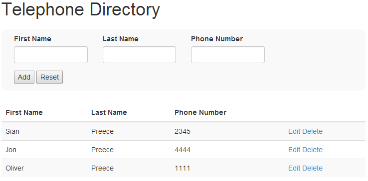
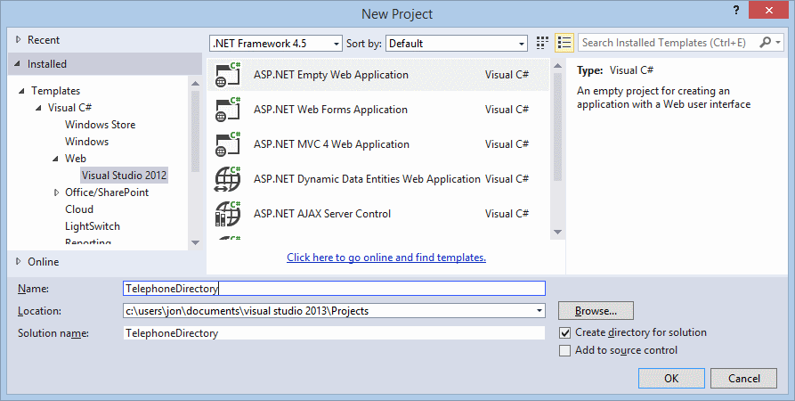

I find that the best way to learn any new technology, or technology that are unfamiliar with, is to sit down and practice. The purpose of this very simple tutorial is to learn the basics of creating a single page website that can be used to capture peoples names and telephone numbers. By following this tutorial you will learn;

1.  How to use Bootstrap to create a simple UI
2.  How to use KnockoutJS for binding to/displaying of your data
3.  How to use jQuery to asynchronously retrieve data from a web service
4.  How to create a simple Web API using C#/ASP .NET
5.  How to persist data using Entity Framework code first

This is part 1 of 2. The second part will be available soon. A screenshot of the end result;



## Prerequisites/Set Up

We will not be using the standard ASP .NET template, for the sake of keeping the code simple and light. Regardless of whether you are using Visual Studio 2012 or 2013, start by creating a new **ASP .NET Empty Web Application**. Call the project **TelephoneDirectory**.



We're using this template to avoid a lot of the bulk that comes with the other default templates. The empty project is truely empty, apart from a web.config file and a couple of references.

### Third party dependencies

Next, use the Package Manager Console to add our third party dependencies;

* Bootstrap (`Install-Package bootstrap` (this will also bring down jQuery, which is a dependency)) >> Used to give us a super pretty user interface.
* Entity Framework (`Install-Package entityframework`) >> Used for data persistence
* KnockoutJS (`install-package knockoutjs` (which surprisingly, has no dependencies itself)) >> Used for model binding our form/displaying our data
* WebAPI (`Install-Package Microsoft.AspNet.WebApi`) >> Used as the back end data service
* Newtonsoft.Json (`install-package Newtonsoft.Json`) >> Used to JSON-ify our data servers responses

### Other files

Add the following files in their respective folders;

* Scriptsindex.js
* Contentsite.css
* index.html
* Global.asax (Add New Item > Global Application Class)

Open up **index.html** and update the markup as follows; (be sure to substitute the version numbers for the current version number)

* Add **bootstrap.min.css** and **site.css** to the header
* Add **jquery-1.9.0.min.js**, **bootstrap.min.js, knockout-3.1.0.js** and **index.js** to the body (just above the closing body tag)

Remember that order matters. You markup should look as follows;

```html
<!DOCTYPE html>
<html xmlns="http://www.w3.org/1999/xhtml">
<head>
    <title></title>
    <link href="Content/bootstrap.min.css" rel="stylesheet" />
    <link href="Content/site.css" rel="stylesheet" />
</head>
<body>
    <script src="jquery-1.9.0.min.js"></script>
    <script src="knockout-3.1.0.js"></script>
    <script src="index.js"></script>
</body>
</html>
```

## Implement your model

Its always a bit tricky with where to start on these tutorials. Normally you might spec out a simple UI first and experiment with feeding data to it and evolve the design over a little time, but as this is a guided tutorial, I already know what the end result will be. So stick with me. We are using the Entity Framework code first approach for simplicity, so we can create our entities straight in code. We will need a property to store the ID of the telephone entry (more on this as we go along), the first name, the last name and the number. Add a new folder called **Models** and add a new class called **TelephoneEntry**, as follows;

```csharp
public class TelephoneEntry
{
    public string FirstName { get; set; }
    public int Id { get; set; }
    public string LastName { get; set; }
    public string Number { get; set; }
}
```

Now we need a database context, which we can use to query our database. Create a **DbContext** class, called **DataContext** as follows (you can add this class to the **Models** folder for simplicity, ideally all your data access code should be split out into its own project, but that is out of the scope of this post);

```csharp
public class DataContext : DbContext
{
    public DbSet<TelephoneEntry> TelephoneEntries { get; set; }
}
```

To help aid our testing further down the line, it will be helpful to have some seed data. Create a custom initializer, called **Initializer**, which inherits from the **DropCreateDatabaseAlways** database initializer. This will ensure that we start with a fresh database every time our application starts (you would want to change this in a production environment, but its super handy for debugging purposes);

```csharp
public class Initializer : DropCreateDatabaseAlways<DataContext>
{
    protected override void Seed(DataContext context)
    {
        context.TelephoneEntries.Add(new TelephoneEntry { FirstName = "Jon", LastName = "Preece", Number = "4444" });
    }
}
```

Override the seed data and add in a new entry (or several if you like), as shown above. For the final step, we need to initialize our database. You can do this in **Global.asax.cs**, inside the **Application_Start** method;

```csharp
protected void Application_Start()
{
     Database.SetInitializer(new Initializer());
}
```

From the database creation perspective, we're done. We will query the database a little later on when creating our Web API.

## Set up your Web API

Web API is very easy to work with out of the box. At a high level, it pretty much "just works", which is fantastic. One could write a whole book on the ins-and-outs of Web API, but we only need to make use of its basic functionality at this time. Create a new folder called **App_Start** and add a new class called **WebApiConfig.cs**. This class will contain routing instructions so that our API Controller (coming next) can be accessed as a Restful service. Add the following static method;

```csharp
public static void Register(HttpConfiguration config)
{
    config.MapHttpAttributeRoutes();
    config.Routes.MapHttpRoute("DefaultApi", "api/{controller}/{id}", new { id = RouteParameter.Optional });

   JsonMediaTypeFormatter jsonFormatter = config.Formatters.OfType<JsonMediaTypeFormatter>().First();
    jsonFormatter.SerializerSettings.ContractResolver = new CamelCasePropertyNamesContractResolver();
}
```

You may now be wondering what is the purpose of this **JsonMediaTypeFormatter**? Well, when a client attempts to access the Web API, it can specify what type of content it accepts in response (by passing an appropriate Content-Type header). Out of the box, Web API and respond in two formats; XML and JSON. XML is supported because it is widely used and has been around a long time (although its scarily bulky). JSON is a very lean [duck typed](http://en.wikipedia.org/wiki/Duck_typing) language that can be very efficiently transferred and interpreted. Unfortunately Web API, when replying with data to the client, responds in Pascal Case (ThisIsPascalCase), whereas JavaScript is typically written in Camel Case (thisIsCamelCase). The **JsonMediaTypeFormatter** ensures that our JSON is sent to the client in camel case, so that it can be properly consumed by the client. You should call the Register method from the **Global.asax.cs Application_Start** method, as shown;

```csharp
protected void Application_Start()
{
    GlobalConfiguration.Configure(WebApiConfig.Register);
    Database.SetInitializer(new Initializer());
}
```

## Design your Web API

Lets take a step back a minute to discuss whatWeb API is. Perfectly summed up by [Wikipedia](http://en.wikipedia.org/wiki/Web-API);

> A server-side web API is a programmatic interface to a defined request-response message system, typically expressed in JSON or XML, which is exposed via the web-most commonly by means of an HTTP-based web server.

Web API is a publically accessible interface for accessing data via HTTP. Web API uses conventions (or you can actually use routing attributes, but that's another discussion) to map your methods to the associated HTTP verbs.

### Get

So, if you want to respond to a HTTP GET request, you add a **Get** method to your controller. If you want to respond to a HTTP DELETE request, you add a **Delete** method to your controller ... and so on. For this tutorial, we will add methods to respond to Get (with overloads), Delete and Post requests. Create a new folder called **Controllers**, and add a new class called **DataController**. Make sure the class inherits from **ApiController** (rather than the standard **Controller** base class) and add the following method;

```csharp
public class DataController : ApiController
 {
     public async Task<IEnumerable<TelephoneEntry>> Get()
     {
        using (DataContext context = new DataContext())
        {
            return await context.TelephoneEntries.ToListAsync();
        }
    }
 }
```

In the interest of maximum scalability (its important to think ahead) you can make your method asynchronous (by using the **async** and **await** keywords) and use the **Async** versions of methods where possible, although you should know that this is not required (but a good habit to get into). Interestingly, you can now open up a web browser (by pressing F5) and query this method. Your browser will send a Get request by default; (note that your port number will vary to mine)


Well done, your API is now working. The method you have added will return all the telephone entries by default. Now, add the following method;

```csharp
public async Task<TelephoneEntry> Get(int id)
{
    using (DataContext context = new DataContext())
    {
        return await context.TelephoneEntries.FirstOrDefaultAsync(t => t.Id == id);
    }
}
```

Change the URL to pass in an ID as follows; [http://localhost:62129/api/Data/1](http://localhost:62129/api/Data/1 'http://localhost:62129/api/Data/1') or [http://localhost:62129/api/Data?id=1](http://localhost:62129/api/Data?id=1 'http://localhost:62129/api/Data?id=1'). A little challenge for you, can you add a couple more methods to query the data based on a search query and a first/last name? I'll wait here whilst you try. All done? See how yours compares to mine;

```csharp
public async Task<List<TelephoneEntry>> Get(string query)
{
    using (DataContext context = new DataContext())
    {
        return await context.TelephoneEntries.Where(t => string.Equals(t.FirstName, query) '' string.Equals(t.LastName, query)).ToListAsync();
    }
} public async Task<List<TelephoneEntry>> Get(string firstName, string lastName)
{
    using (DataContext context = new DataContext())
    {
        return await context.TelephoneEntries.Where(t => string.Equals(t.FirstName, firstName) && string.Equals(t.LastName, lastName)).ToListAsync();
    }
}
```

### Delete

If you want the client to be able to delete data (and we do), you will want to add a delete method. To call the delete method, a DELETE HTTP verb will need to be sent with the request (we will see this in action later). An identifier for the entity to delete will also need to be sent (in this case, the ID. Again we will see this later). Add the following delete method;

```csharp
public void Delete(int id)
{
    using (DataContext context = new DataContext())
    {
        TelephoneEntry entity = context.TelephoneEntries.FirstOrDefault(t => t.Id == id);
        if (entity != null)
        {
            context.Entry(entity).State = EntityState.Deleted;
        }
        context.SaveChanges();
    }
}
```

### Post

A post request is slightly different to the other methods already discussed. In this case, we need to pass a more complex object from the client than just a simple ID or a string. We want to pass the actual **TelephoneEntry** entity that we want to create. For completeness, we need to add the **FromBody** attribute to our parameter, which tells Web API to use the model binder (media type binder to be precise) to extract values from the HTTP message (rather than the URI), and create the object for us without us having to worry about it. Add your post method as follows;

```csharp
public async Task<int> Post([FromBody] TelephoneEntry telephoneEntry)
{
    using (DataContext context = new DataContext())
    {
        if (telephoneEntry.Id == 0)
        {
            context.Entry(telephoneEntry).State = EntityState.Added;
        }
        else
        {
            context.Entry(telephoneEntry).State = EntityState.Modified;
        }         await context.SaveChangesAsync();
        return telephoneEntry.Id;
    }
}
```

There you go. You data is now ready to be accessed and consumed by the outside world!

## Summary

So far we have explored the basic structure for our project, we have installed all our dependent packages, we have created a database using Entity Framework code first, and we have created a publicly available Web API. In the second part of this post, we will flesh out our view, add KnockoutJS to make our page interactive, and use jQuery to tie everything together. The entire source code can be found on [GitHub](https://github.com/jpreecedev/telephonedirectory)
