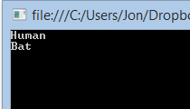

You have probably added various attributes to your ASP .NET MVC applications, desktop applications, or basically any software you have developed using C# recently. Attributes allow you to provide meta data to the consuming code, but have you ever created and consumed your own attributes? This very quick tutorial shows how to create your own attribute, apply it to your classes, and then read out its value.

## Sample Project

To demonstrate this concept, I have created a Console application and added a few classes. This is an arbitrary example just to show off how its done. The basic foundation of our project is as follows;

```csharp
namespace Reflection {
 using System;
 using System.Collections.Generic;
 using System.Linq;
 using System.Reflection;

 internal class Program {
  private static void Main() {
   //TODO
  }
 }

 public interface IMammal {
  bool IsWarmBlooded {
   get;
  }
 }

 public class BaseMammal {
  public bool IsWarmBlooded {
   get {
    return true;
   }
  }
 }

 public class Human: BaseMammal, IMammal {}

 public class Bat: BaseMammal, IMammal {}

 public class DuskyDolphin: BaseMammal, IMammal {}

}
```

We will create an attribute, and apply it to each of the Mammal classes, then write some code to display the value of the attribute to the user. The attribute will hold the latin (scientific) name of the mammal.

## Create/Apply an attribute

There are two ways to create an attribute in C#, the easy way or the manual way. If you want to make your life a whole lot easier, you should use the **Attribute** code snippet. To use the **Attribute** snippet, simply start typing **Attribute** and press **Tab Tab** on the keyboard.  Call the attribute **LatinNameAttribute**, accept the other defaults, delete all the comments that come as part of the snippet, and add a public property called **Name** (type System.String). Your attribute should be as follows;

```csharp
[AttributeUsage(AttributeTargets.Class, Inherited = false, AllowMultiple = true)]
internal sealed class LatinNameAttribute: Attribute {
 public LatinNameAttribute(string name) {
  Name = name;
 }

 public string Name {
  get;
  set;
 }
}
```

Go ahead and apply the attribute to a couple of classes, as follows;

```csharp
[LatinName("homo sapiens")]
public class Human: BaseMammal, IMammal {}

[LatinName("Chiroptera")]
public class Bat: BaseMammal, IMammal {}

public class DuskyDolphin: BaseMammal, IMammal {}
```

Now that we have written the attribute and applied it, we just have to write some code to extract the actual value.

## Discovering attributes

It is common to create a helper class for working with attributes, or perhaps put the code on a low level base class. Ultimately it is up to you. We only care at this stage about reading out all of the attributes that exist in our code base. To do this, we must discover all the types in our assembly that are decorated with the attribute in question (See **A Step Further**). Create a new class, named `LatinNameHelper` and add a method named `DisplayLatinNames`.

```csharp
public class LatinNameHelper {
 public void DisplayLatinNames() {
  IEnumerable<string> latinNames = Assembly.GetEntryAssembly().GetTypes().Where(t => t.GetCustomAttributes(typeof(LatinNameAttribute), true).Any()).Select(t => ((LatinNameAttribute) t.GetCustomAttributes(typeof(LatinNameAttribute), true).First()).Name);

  foreach(string latinName in latinNames) {
   Console.WriteLine(latinName);
  }
 }
}
```

Lets step through each line;

1.  Get all the types in the current assembly
2.  Filter the list to only include classes that are decorated with our `LatinNameAttribute`
3.  Read the first `LatinNameAttribute` you find decorated on the class (we stated that we can have more than one attribute defined on our attribute) and select the value of the `Name` property.
4.  Loop through each latin name, write it out for the user to see

Note that I have only decorated `Human` and `Bat` with `LatinNameAttribute`, so you should only get two outputs when you run the program.  For the sake of completeness, here is the `Main` method;

```csharp
internal class Program {
 private static void Main() {
  LatinNameHelper helper = new LatinNameHelper();
  helper.DisplayLatinNames();

  Console.ReadLine();
 }
}
```

Congratulations... you have written an attribute, decorated your classes with it, and consumed the value.

## A step further

A common practice is to use attributes to identify classes/or methods that instantiate/run. If you want to do this, you can use `Activator.CreateInstance` to instantiate the class and then you can cast it to an interface to make it easier to work with. Add a new method to `LatinNameHelper` called `GetDecoratedMammals` as follows;

```csharp
public void GetDecoratedMammals() {
 IEnumerable < IMammal > mammals = Assembly.GetEntryAssembly().GetTypes().Where(t => t.GetCustomAttributes(typeof(LatinNameAttribute), true).Any()).Select(t => (IMammal) Activator.CreateInstance(t));

 foreach(var mammal in mammals) {
  Console.WriteLine(mammal.GetType().Name);
 }
}
```

## Summary

C# features attributes, which can be used to add meta data to a class, method, property (basically anything). You can create your own custom attributes by creating a class derived from `Attribute` and adding your own properties to it. You can then find all the classes that are decorated with the attribute using reflection, and read out any meta data as needed. You can also use the `Activator` to create an instance of the class that is decorated with your attribute and do anything you require.
