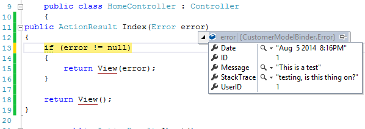

Model binding is the process of converting POST data or data present in the Url into a .NET object(s). ASP .NET MVC makes this very simple by providing the [DefaultModelBinder](<http://msdn.microsoft.com/en-us/library/system.web.mvc.defaultmodelbinder(v=vs.118).aspx>). You've probably seen this in action many times (even if you didn't realise it!), but did you know you can easily write your own?

## A typical ASP .NET MVC Controller

You've probably written or seen code like this many hundreds of times;

```csharp
public ActionResult Index(int id) {
 using(ExceptionManagerEntities context = new ExceptionManagerEntities()) {
  Error entity = context.Errors.FirstOrDefault(c => c.ID == id);

  if (entity != null) {
   return View(entity);
  }
 }

 return View();
}
```

Where did **Id** come from? It probably came from one of three sources; the Url (`Controller/View/{id}`), the query string (`Controller/View?id={id}`), or the post data. Under the hood, ASP .NET examines your controller method, and searches each of these places looking for data that matches the data type and the name of the parameter. It may also look at your route configuration to aid this process.

## A typical controller method

The code shown in the first snippet is very common in many ASP .NET MVC controllers. Your action method accepts an **Id** parameter, your method then fetches an entity based on that Id, and then does something useful with it (and typically saves it back to the database or returns it back to the view). You can create your own MVC model binder to cut out this step, and simply have the entity itself passed to your action method. Take the following code;

```csharp
public ActionResult Index(Error error) {
 if (error != null) {
  return View(error);
 }

 return View();
}
```

How much sweeter is that?

## Create your own ASP .NET MVC model binder

You can create your own model binder in two simple steps;

1.  Create a class that inherits from `DefaultModelBinder`, and override the `BindModel` method (and build up your entity in there)
2.  Add a line of code to your **Global.asax.cs** file to tell MVC to use that model binder.

Before we forget, tell MVC about your model binder as follows (in the **Application_Start** method in your **Global.asax.cs** file);

```csharp
ModelBinders.Binders.Add(typeof(Error), new ErrorModelBinder());
```

This tells MVC that if it stumbles across a parameter on an action method of type **Error**, it should attempt to bind it using the **ErrorModelBinder** class you just created. Your **BindModel** implementation will look like this;

```csharp
public override object BindModel(ControllerContext controllerContext, ModelBindingContext bindingContext) {
 if (bindingContext.ModelType == typeof(Error)) {
  ValueProviderResult valueProviderValue = bindingContext.ValueProvider.GetValue("id");

  int id;
  if (valueProviderValue != null && int.TryParse((string) valueProviderValue.RawValue, out id)) {
   using(ExceptionManagerEntities context = new ExceptionManagerEntities()) {
    return context.Errors.FirstOrDefault(c => c.ID == id);
   }
  }
 }

 return base.BindModel(controllerContext, bindingContext);
}
```

The code digested;

1.  Make sure that we are only trying to build an object of type **Error** (this should always be true, but just as a safety net lets include this check anyway).
2.  Get the **ValueProviderResult** of the value provider we care about (in this case, the Id property).
3.  Check that it exists, and that its definitely an integer.
4.  Now fetch our entity and return it back.
5.  Finally, if any of our safety nets fail, just return back to the model binder and let that try and figure it out for us.

And the end result?  Your new model binder can now be used on any action method throughout your ASP .NET MVC application.

## Summary

You can significantly reduce code duplication and simplify your controller classes by creating your own model binder. Simply create a new class that derives from **DefaultModelBinder** and add your logic to fetch your entity. Be sure to add a line to your `Global.asax.cs` file so that MVC knows what to do with it, or you may get some confusing error messages.
