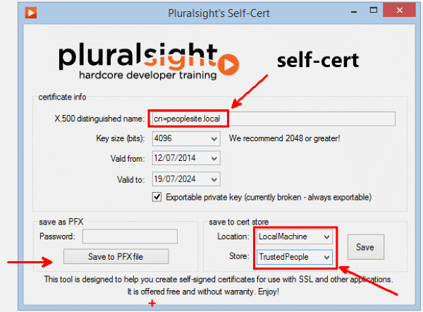
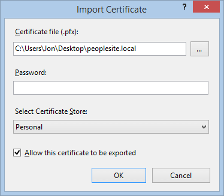
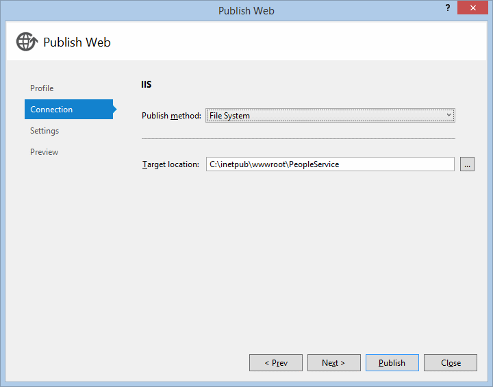
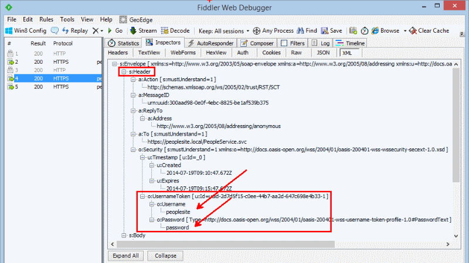
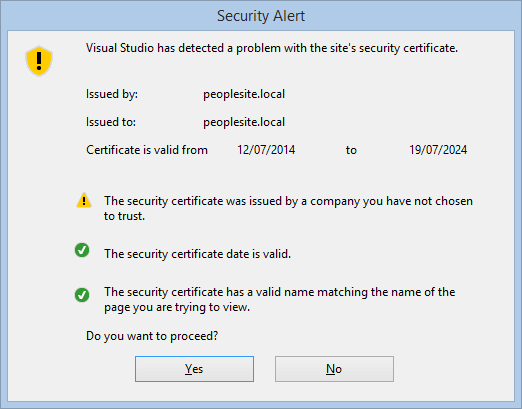

There are several steps involved in making your WCF service secure, and ensure that clients consuming your service are properly authenticated. WCF uses [BasicHttpBinding](<http://msdn.microsoft.com/en-us/library/system.servicemodel.basichttpbinding(v=vs.110).aspx> 'BasicHttpBinding') out-of-the-box, which generates SOAP envelopes (messages) for each request. `BasicHttpBinding` works over standard HTTP, which is great for completely open general purpose services, but not good if you are sending sensitive data over the internet (as HTTP traffic can easily be intercepted). This post discusses how to take a basic WCF service, which uses `BasicHttpBinding`, and upgrade it to use [WsHttpBinding](<http://msdn.microsoft.com/en-us/library/system.servicemodel.wshttpbinding(v=vs.110).aspx> 'WsHttpBinding') over SSL (with username/password validation). If you want to become a better WCF developer, you may want to check out [Learning WCF: A Hands-on Guide](http://www.amazon.co.uk/gp/product/0596101627/ref=as_li_tf_tl?ie=UTF8&camp=1634&creative=6738&creativeASIN=0596101627&linkCode=as2&tag=jprecom-21) by Michele Lerouz Bustamante. This is a very thorough and insightful WCF book with detailed and practical samples and tips. Here is the basic sequence of steps needed;

* Generate a self-signed SSL certificate (you would use a real SSL certificate for live) and add this to the **TrustedPeople** certificate store.
* Add a [UserNamePasswordValidator](<http://msdn.microsoft.com/en-us/library/system.identitymodel.selectors.usernamepasswordvalidator(v=vs.110).aspx> 'UserNamePasswordValidator').
* Switch our `BasicHttpBinding` to `WsHttpBinding`.
* Change our MEX (**M**etadata **Ex**change) endpoint to support SSL.
* Specify how the client will authenticate, using the [ServiceCredentials](<http://msdn.microsoft.com/en-us/library/system.servicemodel.description.servicecredentials(v=vs.110).aspx> 'ServiceCredentials') class.

You may notice that _most_ of the changes are configuration changes. You can make the same changes in code if you so desire, but I find the process easier and cleaner when done in XML.

## BasicHttpBinding vs. WsHttpBinding

Before we kick things off, i found myself asking this question (like so many others before me). What is the difference between `BasicHttpBinding` and `WsHttpBinding`? If you want a very thorough explanation, there is a [very detailed explanation written by Shivprasad Koirala on CodeProject.com](http://www.codeproject.com/Articles/36396/Difference-between-BasicHttpBinding-and-WsHttpBind 'Different between BasicHttpBinding as WsHttpBinding'). I highly recommend that you check this out. The TL:DR version is simply this;

* `BasicHttpBinding` supports SOAP v1.1 (`WsHttpBinding` supports SOAP v1.2)
* `BasicHttpBinding` does not support Reliable messaging
* `BasicHttpBinding` is insecure, `WsHttpBinding` supports WS-\* specifications.
* `WsHttpBinding` supports transporting messages with credentials, `BasicHttpBinding` supports only Windows/Basic/Certificate authentication.

## The project structure

You can view and download the full source code for this project via GitHub, see the end of the post for more details. We have a WCF Service application with a Service Contract as follows;

```csharp
[ServiceContract]
public interface IPeopleService
{
    [OperationContract]
    Person[] GetPeople();
}
```

And the implementation of the Service Contract;

```csharp
public class PeopleService : IPeopleService
{
    public Person[] GetPeople()
    {
        return new[]
                    {
                        new Person { Age = 45, FirstName = "John", LastName = "Smith" },
                        new Person { Age = 42, FirstName = "Jane", LastName = "Smith" }
                    };
    }
}
```

The model class (composite type, if you will) is as follows;

```csharp
[DataContract]
public class Person
{
    [DataMember]
    public int Age { get; set; }

    [DataMember]
    public string FirstName { get; set; }

    [DataMember]
    public string LastName { get; set; }
}
```

The initial configuration is as follows;

```xml
<system.serviceModel>
  <behaviors>
    <serviceBehaviors>
      <behavior>
        <serviceMetadata httpGetEnabled="true" httpsGetEnabled="true"/>
        <serviceDebug includeExceptionDetailInFaults="false"/>
      </behavior>
    </serviceBehaviors>
  </behaviors>
  <protocolMapping>
    <add binding="basicHttpsBinding" scheme="https"/>
  </protocolMapping>
  <serviceHostingEnvironment aspNetCompatibilityEnabled="true" multipleSiteBindingsEnabled="true"/>
</system.serviceModel>
```

The WCF service can easily be hosted in IIS, simply add a service reference to the WSDL definition file and you're away. In the interest of completeness, here is the entire client code;

```csharp
static void Main(string[] args)
{
    PeopleServiceClient client = new PeopleServiceClient();

    foreach (var person in client.GetPeople())
    {
        Console.WriteLine(person.FirstName);
    }

    Console.ReadLine();
}
```

## Hosting in IIS

As briefly mentioned, you can (and probably always will) host your WCF service using Internet Information Services (IIS).

### Generating an SSL certificate

Before doing anything, you need an SSL certificate. Transport based authentication simply does not work if A) You are not on a secure channel and B) Your SSL certificate is not trusted. You don't have to purchase an SSL certificate at this stage as a self-signed certificate will suffice (with 1 or 2 extra steps). You will want to purchase a real SSL certificate when you move your service to the production environment. You can generate a self-signed SSL certificate either 1 of 2 ways. You can either do it the hard way, using Microsoft's rather painful [MakeCert.exe Certificate Creation Tool](<http://msdn.microsoft.com/en-us/library/bfsktky3(v=vs.110).aspx> 'MakeCert.exe Certificate Creation Tool') or you can [download a free tool from PluralSight](http://blog.pluralsight.com/selfcert-create-a-self-signed-certificate-interactively-gui-or-programmatically-in-net 'PluralSight Self-Cert') (of all places), which provides a super simple user interface and can even add the certificate to the certificate store for you. Once you have downloaded the tool, run it as an Administrator;



For the purposes of this tutorial, we will be creating a fake website called **peoplesite.local**. We will add an entry into the hosts file for this and set it up in IIS. Its very important that the **X.500 distinguished name** matches your domain name (or it will not work!). You will also want to save the certificate as a PFX file so that it can be imported into IIS and used for the HTTPS binding. Once done open up IIS, click on the root level node, and double click on **Server Certificates**. Click **Import** (on the right hand side) and point to the PFX file you saved on the desktop. Click **OK** to import the certificate.



Next, create a new site in IIS called **PeopleService**. Point it to an appropriate folder on your computer and edit the site bindings. Add a new HTTPS binding and select the SSL certificate you just imported.


Be sure to remove the standard HTTP binding after adding the HTTPS binding as you wont be needing it. Update the hosts file (C:\Windows\System32\Drivers\etc\hosts) with an entry for **peoplesite.local** as follows;

<pre>127.0.0.1            peoplesite.local</pre>

Finally, flip back to Visual Studio and create a publish profile (which we will use later once we have finished the configuration). The publish method screen should look something like this;



## Configuration

Ok we have set up our environment, now its time to get down to the fun stuff...configuration. Its easier if you delete everything you have between the `<system.serviceModel>` elements and follow along with me. Add the following skeleton code between the `<system.serviceModel>` opening and closing tags, we will fill in each element separately; (update the **Service Name** to match that in your project)

```xml
<services>
  <service name="PeopleService.Service.PeopleService" behaviorConfiguration="ServiceBehaviour">
    <host>
    </host>
  </service>
</services>
<bindings>
</bindings>
<behaviors>
  <serviceBehaviors>
  </serviceBehaviors>
</behaviors>
```

### Base Address

Start by adding a base address (directly inside the **host** element) so that we can use relative addresses';

```xml
<baseAddresses>
  <add baseAddress="https://peoplesite.local/" />
</baseAddresses>
```

### Endpoints

Next, add two endpoints (one for the `WsHttpBinding` and one for MEX);

```xml
<endpoint address="" binding="wsHttpBinding" bindingConfiguration="BasicBinding" contract="PeopleService.Service.IPeopleService" name="BasicEndpoint" />
<endpoint address="mex" binding="mexHttpsBinding" contract="IMetadataExchange" name="mex" />
```

Note that we are using `mexHttpsBinding` because our site does not support standard HTTP binding. We don't need to explicitly add a binding for the MEX endpoint as WCF will deal with this automatically for us. Add a `wsHttpBinding` as follows;

```xml
<wsHttpBinding>
  <binding name="BasicBinding">
    <security mode="TransportWithMessageCredential">
      <message clientCredentialType="UserName" />
    </security>
  </binding>
</wsHttpBinding>
```

### Bindings

This is where we specify what type of security we want to use. In our case, we want to validate that the user is whom they say they are in the form of a username/password combination. The [TransportWithMessageCredential](<http://msdn.microsoft.com/en-us/library/system.servicemodel.basichttpsecuritymode(v=vs.110).aspx> 'TransportWithMessageCredential')basic http security mode requires the username/password combination be passed in the message header. A snoop using a HTTP proxy tool (such as [Fiddler](http://www.telerik.com/fiddler 'Fiddler')) reveals this;



### Service Behaviours

Finally we need to update our existing service behaviour with a `serviceCredentials` element as follows;

```xml
<behavior name="ServiceBehaviour">
  <serviceMetadata httpGetEnabled="true" httpsGetEnabled="true" />
  <serviceDebug includeExceptionDetailInFaults="true" />
  <serviceCredentials>
    <userNameAuthentication userNamePasswordValidationMode="Custom" customUserNamePasswordValidatorType="PeopleService.Service.Authenticator, PeopleService.Service" />
    <serviceCertificate findValue="peoplesite.local" storeLocation="LocalMachine" storeName="TrustedPeople" x509FindType="FindBySubjectName" />
  </serviceCredentials>
</behavior>
```

The two elements of interest are `userNameAuthentication` and `serviceCertificate`.

#### User Name Authentication

This is where we tell WCF about our custom authentication class. Lets go ahead and create this. Add a new class to your project called **Authenticator.cs** and add the following code;

```csharp
using System.IdentityModel.Selectors;
using System.ServiceModel;

public class Authenticator : UserNamePasswordValidator
{
    public override void Validate(string userName, string password)
    {
        if (userName != "peoplesite" && password != "password")
        {
            throw new FaultException("Invalid user and/or password");
        }
    }
}
```

Basically, you can add whatever code you want here to do your authentication/authorisation. Notice that the **Validate** method returns `void`. If you determine that the credentials supplied are invalid, you should throw a [FaultException](<http://msdn.microsoft.com/en-us/library/ms576199(v=vs.110).aspx>), which will be automatically handled for you by WCF. You should ensure that the `customUserNamePasswordValidatorType` attribute in your App.config file is the fully qualified type of your authenticator type.

#### Service Certificate

This is key, if this is not _quite_ right nothing will work. Basically you are telling WCF where to find your SSL certificate. Its very important that the **findValue** is the same as your SSL certificate name, and that you point to the correct certificate store. Typically you will install the certificate on the **LocalMachine** in the **TrustedPeople** certificate store. I would certainly recommend sticking with the **FindBySubjectName** search mode, as this avoid issues when you have multiple SSL certificates with similar details. You may need a little trial and error when starting out to get this right. If you have been following this tutorial throughout, you should be OK with the default.

## Supplying user credentials

We just need one final tweak to our test client to make all this work. Update the test client code as follows;

```csharp
PeopleServiceClient client = new PeopleServiceClient();
client.ClientCredentials.UserName.UserName = "peoplesite";
client.ClientCredentials.UserName.Password = "password";
```

We pass in the client credentials via the, you guessed it, `ClientCredentials` object on the service client. If you run the client now, you should get some test data back from the service written out to the console window. Notice that you will get an exception if the username/password is incorrect, or if the connection is not over SSL.

## Troubleshooting

### SecurityNegotiationException

As an aside, if you receive a [SecurityNegotiationException](<http://msdn.microsoft.com/en-us/library/system.servicemodel.security.securitynegotiationexception(v=vs.110).aspx>) please ensure that your self-signed certificate is correctly named to match your domain, and that you have imported it into the **TrustedPeople** certificate store.


A handy trick for diagnosing the problem is by updating the service reference, Visual Studio will advise you as to what is wrong with the certificate;



## Summary

With a few small configuration changes you can easily utilise WS-Security specifications/standards to ensure that your WCF service is secure. You can generate a self-signed SSL certificate using a free tool from Pluralsight, and install it to your local certificate store and IIS. Then you add a `UserNamePasswordValidator` to take care of your authentication. Finally, you can troubleshoot and debug your service using Fiddler and Visual Studio.

The source code is available on [GitHub](https://github.com/jpreecedev/WCFSecurity)
