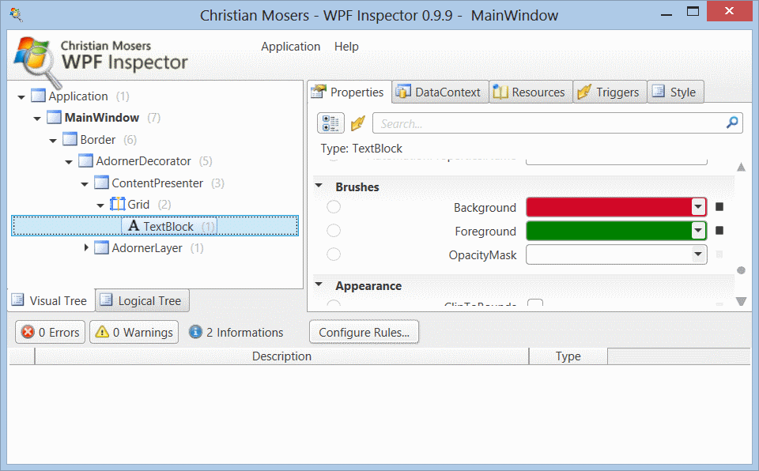
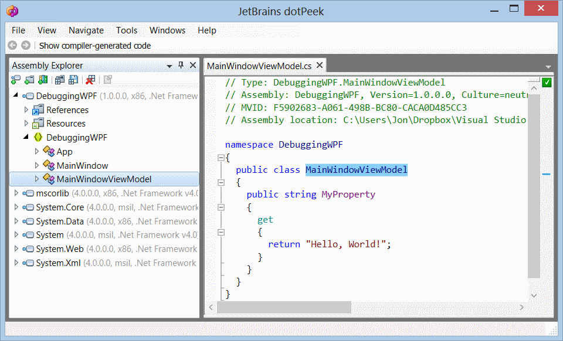

Being able to effectively debug any application is key to the success of an application. Every developer, no matter how good they are or how long they have been writing code, introduces bugs. Debugging is the process of identifying bugs and removing them. WPF applications can be particularly hard to debug, if you are not using the correct tools. This post attempts to help you utilise various free tools to help simplify the debugging process.

### Binding Errors

Binding errors are very common in all WPF applications. Binding errors are errors that occur when bindings in your view to properties on your view model to not match. Take the following example; The view;

```xml
<Window x:Class="DebuggingWPF.MainWindow"
	xmlns="http://schemas.microsoft.com/winfx/2006/xaml/presentation"
	xmlns:x="http://schemas.microsoft.com/winfx/2006/xaml"
	xmlns:local="clr-namespace:DebuggingWPF" Title="MainWindow" Height="350" Width="525">
	<Window.DataContext>
		<local:MainWindowViewModel />
	</Window.DataContext>
	<Grid>
		<TextBlock Text="{Binding DisplayProperty, Mode=Oneway}" />
	</Grid>
</Window>
```

And the view model;

```csharp
public class MainWindowViewModel {
 public string MyProperty {
  get {
   return "Hello, World!";
  }
 }
}
```

What is the output of the above code? Are you expecting to see "Hello World" written out to the screen? Is this case, there is no output to the screen. So what went wrong? Well on close inspection of the XAML and C# code, we can see that there is a mistake in our XAML. The binding expression points to a property called `DisplayProperty`, where as our view model does not have this property, it instead has a property called `MyProperty`. This mistake was easy to identify because we only have a few lines of code. However, as soon as your application begins to get more complicated (that doesn't take long when working with WPF :)) these sorts of problems become much harder to fix. You may be wondering... why doesn't Visual Studio throw an exception when a binding fails? Well apparently its an _optimization_ (sorry I don't have an citations for that claim!). In any case, Visual Studio helps you out here. Simply open the Output Window (Debug > Windows > Output) and search for "BindingExpression". You should find all the binding errors that occurred since your program started running;


An alternative approach would be to make use of [BindingSource.UpdateSourceExceptionFilter](http://msdn.microsoft.com/en-us/library/system.windows.data.binding.updatesourceexceptionfilter.aspx 'BindingSource.UpdateSourceExceptionFilter'), which can be helpful when debugging individual properties. As far as I am aware, this type of approach cannot be used at a global level.

### WPF Inspector

A tool I have found very helpful over the years is called [WPF Inspector](http://wpfinspector.codeplex.com/ 'WPF Inspector'). I commonly refer to this tool as being the _best_ and _worst tool ever made_, for lots of reasons ... including;

* Its unstable ... it has a bad habit of crashing exactly when you find what you're after
* Its slow (sorry, but it just is)
* The user interface is messy ... the treeview on the left hand side is a hinderance
* It allows other developers (malicious or not) to snoop at my code

However, there are also a lot of reasons in favour of using this tool;

* It effectively visualises the Visual tree (the hierarchical structure of your XAML code)
* It allows for on-the-fly tweaking of property values
* It makes suggestions and recommendations on how your code can be improved and optimized
* It allows me to snoop on other developers code!

To use WPF Inspector is straight forward. Run your application, and then run WPF Inspector. <strike>After what will feel like hours (but will actually more likely be just a few seconds)</strike> WPF Inspector will discover your application and you can click "Attach" to hook WPF Inspector onto your application. You can then start expanding out the nodes on the left hand side until you discover the elements that you are interested in. You can then tweak and change properties to your hearts content; WPF inspector with some properties changed;



And the application after tinkering;


Once you kill your application, all changes will be lost ... so try to keep track of any changes you have made! WPF Inspector is a very useful tool and will save you hours of time (and help your sanity as well!)

### Reverse Engineering

Sometimes your code just refuses to work. A very good technique for helping to identify problems is by looking at your actual compiled source code. Opening a compile application and viewing the original source code is a process known as _Reverse engineering_. There are many tools available to reverse engineer WPF applications (or indeed any .NET application) that hasn't been [obfuscated](http://en.wikipedia.org/wiki/Obfuscation 'Obfuscation'). My preferred tools of choice are [DotPeek](http://www.jetbrains.com/decompiler/ 'DotPeek') (free tool from JetBrains) and [.NET Reflector](http://www.red-gate.com/products/dotnet-development/reflector/ '.NET Reflector') by RedGate. To reverse engineer (decompile) your application, simply fire up your tool of choice and browse to (or drag-and-drop) your applications executable file (exe) or any dynamically linked library (dll). Decompilation is usually very quick (but can take longer depending on the size of your application). You can then simply double click on any class that you want to look at;



The code looks pretty much the same as how you saw it in Visual Studio. This debugging technique is particularly helpful when you are trying to identify problems with third party tools. For example, it is common to use a tool such as [PropertyChanged.Fody](https://github.com/Fody/PropertyChanged 'PropertyChanged.Fody') to inject [INotifyPropertyChanged](http://msdn.microsoft.com/en-us/library/system.componentmodel.inotifypropertychanged.aspx 'INotifyPropertyChanged') code automatically for you at compile time. When change notifications are not <strike>pouring</strike> trickling through as you would expect, it can be helpful to decompile the code and check the class in question. If your automatic properties have not been expanded out and replaced with "compiler generated" properties with backing fields, you know that you have mis-configured the tool. Usually tweaking the tool then resolves the problem. This could literally save hours, if not days, of head scratching.

### Summary

Some problems/bugs can be very difficult to track down in WPF applications. It is important to know what tools are available to help your quickly and easily resolve such issues. Some tools include; the Output window in Visual Studio for identifying binding errors, WPF Inspector for tweaking and changing UI property values on-the-fly, and using decompilation tools to make sure that the compiled code matches what you expect. If you found this blog post useful, please leave a comment below.
