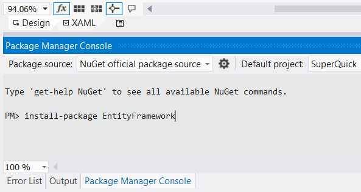
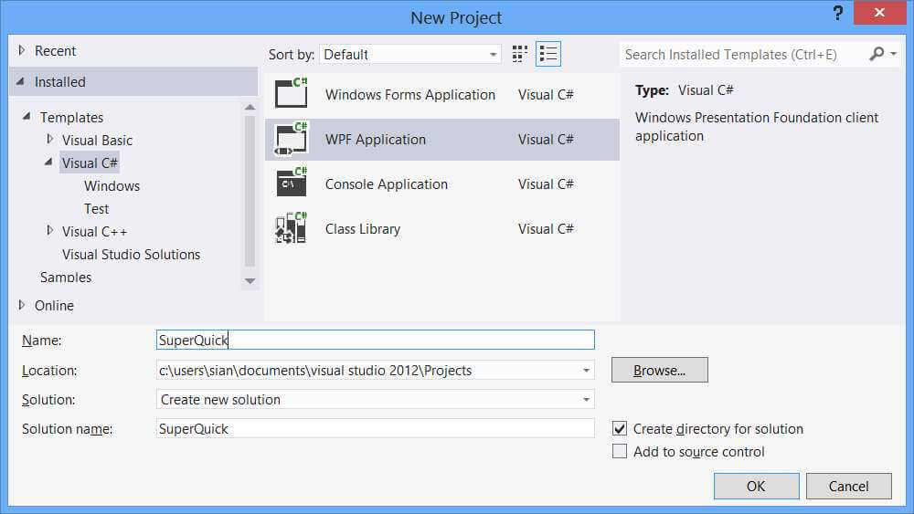

Entity Framework is an [Object Relational Mapper](http://en.wikipedia.org/wiki/Object-relational_mapping 'Object Relational Mapper') (ORM), created by Microsoft and built on top of the popular ADO.NET framework. Entity framework was first released in the second half of 2008. In 2011, with the release of version 4.1, a new feature was introduced... known as "Code First". Code first allows us to write code without having to care (to a certain extent) about the make-up of the database, its tables and their relationships. The idea is that Entity Framework figures all this out for us, and it does a pretty good job! Entity Framework code first is designed around the "convention over configuration" principal, meaning as long as things are named in a consistent way your code should "just work" with very little effort. If its not possible to write your code in a way that Entity Framework understands, it is possible to tell Entity Framework about your model using attributes, the Fluent API, or a combination of both.

### Adding Entity Framework to your project

The quickest way to add Entity Framework to your project is using the Package Manager Console (NuGet). In Visual Studio, click "View > Other Windows > Package Manager Console", and type the following command; `Install-Package EntityFramework`



This process will add all the appropriate references to your project.

### Super Quick Walk-through

This tutorial aims to get you up and running in about 15 minutes. We will create a very simple application, which has a WPF front end and an Entity Framework back end, based around the idea of customers, addresses and orders. Every customer will have an address and optionally they can have orders. So lets get to it, the clock is ticking. Create a new WPF project, call it SuperQuick.



Add the following classes to your project;

- Address.cs
- Customer.cs
- MainWindowViewModel.cs (Model class for our view, as per the [MVVM](http://jpreecedev.wordpress.com/2013/06/08/wpf-mvvm-for-winforms-devs-part-1-of-5/ 'WPF MVVM For WinForms Devs - Part 1/5') specification)
- SuperQuickContext.cs (This will be our database context)
- SuperQuickInitializer.cs (This will define the database initialization strategy)

Add the following code to Customer.cs

```csharp
public class Customer {
 public Customer() {
  Orders = new List<Order>();
 }

 public int Id {
  get;
  set;
 }

 public string FirstName {
  get;
  set;
 }

 public string LastName {
  get;
  set;
 }

 public Address Address {
  get;
  set;
 }

 public virtual List<Order> Orders {
  get;
  set;
 }

 public override string ToString() {
  return string.Format("{0}, {1}", LastName.ToUpper(), FirstName);
 }

}
```

Lets take a moment out to look at this code. Customer will be mapped to its own table in your database, and **Id** will be considered the primary key. Notice that we have a property called **Address** of type Address. Address is a complex type, meaning it consists of multiple fields/properties. How will this be mapped to the database? Well Entity Framework will analyse the class and create a column for each publicly accessible property. The database table will eventually look like this (once we flesh out the Address class);


Notice the naming of each column. This is significant because Entity Framework uses the column name to match the value back to each property on your class. Also note the data type for each column. You can explicitly dictate what data type you want to use (perhaps NVARCHAR(255) for a string no longer than 255 characters) using a combination of attributes and the fluent API. We may cover these topics in more detail in another blog post. Also notice that we have a List of type Order placed by the company. This property basically has a one to many relationship with customer, as a customer can have none, one, or many orders. The property is marked as virtual so that Entity Framework can create a dynamic proxy for the property, which enables for lazy loading and change tracking. This may, when used right, improve performance by only retrieving data when needed. Add the following to Address.cs

```csharp
public class Address {
 public string Line1 {
  get;
  set;
 }

 public string Line2 {
  get;
  set;
 }

 public string Town {
  get;
  set;
 }

 public string PostCode {
  get;
  set;
 }

 public override string ToString() {
  return string.Format("{0}n{1}n{2}n{3}", Line1, Line2, Town, PostCode);
 }
}
```

Next, we need to create a database context (DbContext). We will use the DbContext to tell Entity Framework about our model classes. Add the following code to SuperQuickContext.cs

```csharp
public class SuperQuickContext: DbContext {
 public DbSet<Customer> Customers {
  get;
  set;
 }
}
```

Notice that we haven't created a DbSet for the Address or Order classes? Well Entity Framework detects that Customer has a dependency on these classes, so it just includes them automatically for us. Adding a DbSet for the Order class wouldn't affect the model, but adding a DbSet for Address would result in an error, because Address doesn't have a suitable primary key property. Next, we need to decide which database initialization strategy we want to use. This tells Entity Framework what to do with our database if our model changes (or the database doesn't exist). When developing our project, its fine to use the [DropCreateDatabaseIfModelChanges](http://msdn.microsoft.com/en-us/library/gg679604%28v=vs.103%29.aspx 'DropCreateDatabaseIfModelChanges') or [DropCreateDatabaseAlways](http://msdn.microsoft.com/en-us/library/gg679506%28v=vs.103%29.aspx 'DropCreateDatabaseAlways') strategy. When moving to a release, you may want to disable database initialization and make use of a feature of Entity Framework called "[Code First Migrations](http://msdn.microsoft.com/en-US/data/jj591621 'Code First Migrations')" ... or you will lose all of your data! For us, there is no need to recreate the database unless the model changes, so we will use **DropCreateDatabaseIfModelChanges**. We could override the OnStartup method in App.xaml.cs and set our initializer;

```csharp
protected override void OnStartup(StartupEventArgs e) {
 base.OnStartup(e);

 Database.SetInitializer(new DropCreateDatabaseIfModelChanges());
}
```

But actually this is not quite what we want. We want to introduce seed data to set some "default values" in our database when it gets created or dropped and re-created. Add the following code to SuperQuickInitializer.cs

```csharp
public class SuperQuickInitializer: DropCreateDatabaseIfModelChanges<SuperQuickContext> {
 protected override void Seed(SuperQuickContext context) {
  //Create some dummy data
  Address addressOne = new Address {
   Line1 = "Address Line 1", Line2 = "Address Line 2", PostCode = "AB1 ABC", Town = "The Town"
  };

  Address addressTwo = new Address {
   Line1 = "Second Address 1",
    Line2 = "Second Address 2",
    PostCode = "DE2 DEF",
    Town = "Second Town"
  };

  Customer customerOne = new Customer {
   Address = addressOne,
    FirstName = "Jon",
    LastName = "Preece",
  };

  Customer customerTwo = new Customer {
   Address = addressTwo,
    FirstName = "Mike",
    LastName = "Smith"
  };

  Order order = new Order {
   Amount = 10,
    Item = "Mouse"
  };

  Order orderTwo = new Order {
   Amount = 20,
    Item = "Keyboard"
  };

  Order orderThree = new Order {
   Item = "Monitor",
    Amount = 100
  };

  customerOne.Orders.Add(order);
  customerTwo.Orders.AddRange(new [] {
   orderTwo,
   orderThree
  });

  //Add to the context
  context.Customers.Add(customerOne);
  context.Customers.Add(customerTwo);

  //Save changes
  context.SaveChanges();
 }

}
```

Note we have inherited from `DropCreateDatabaseIfModelChanges` so that we get all the behaviour, whist being able to insert our own seed data. Now flip back over to App.xaml.cs and add the following code;

```csharp
protected override void OnStartup(StartupEventArgs e) {
 base.OnStartup(e);

 Database.SetInitializer(new SuperQuickInitializer());
}
```

### User Interface

We're just about done with setting up our model, so now lets turn our attention to the user interface. First set the MainWindow data context to an instance of MainWindowViewModel. Switch over to MainWindow.xaml and add the following code underneath the opening `Window` tag; (be sure to add an xml namespace, called local)

```xml
<Window.DataContext>
	<local:MainWindowViewModel />
</Window.DataContext>
```

Replace the existing Grid control with the following code;

```xml
<Grid>
	<ScrollViewer>
		<ItemsControl ItemsSource="{Binding Customers}"
                  AlternationCount="2"
                  ScrollViewer.CanContentScroll="True">
			<ItemsControl.ItemTemplate>
				<DataTemplate>
					<StackPanel x:Name="Main">
						<TextBlock Text="{Binding}"
                       FontWeight="Bold"
                       FontSize="14"
                       Padding="10,10,0,0" />
						<TextBlock Text="{Binding Address}"
                       FontSize="12"
                       Padding="10,0,0,10" />
						<StackPanel Orientation="Horizontal">
							<TextBlock Text="Orders:"
                         Margin="0,0,5,0"
                         Padding="10,0,0,10"
                         FontWeight="Bold" />
							<TextBlock Text="{Binding Orders.Count}"
                         Padding="0,0,0,10"/>
						</StackPanel>
					</StackPanel>
					<DataTemplate.Triggers>
						<Trigger Property="ItemsControl.AlternationIndex"
                     Value="0">
							<Setter TargetName="Main"
                      Property="Background"
                      Value="#220000FF" />
						</Trigger>
						<Trigger Property="ItemsControl.AlternationIndex"
                     Value="1">
							<Setter TargetName="Main"
                      Property="Background"
                      Value="White" />
						</Trigger>
					</DataTemplate.Triggers>
				</DataTemplate>
			</ItemsControl.ItemTemplate>
		</ItemsControl>
	</ScrollViewer>
</Grid>
```

This will display our customers, their address, and the number of orders they have placed. To satisfy the XAML, we need to add some code to our view-model ... as follows;

```csharp
public ObservableCollection<Customer> Customers {
 get;
 set;
}
```

Finally, we need to populate the ObservableCollection with code from our database. Add the following constructor to the class;

```csharp
public MainWindowViewModel() {
 var context = new SuperQuickContext();

 Customers = new ObservableCollection(context.Customers);
}
```

### Summary

In this super quick introduction, we have seen how easy it is to create an application that persists data to a database using Entity Framework. We have touched on topics such as complex types, navigation properties database initializers. Subsequent posts will cover more advanced topics such as data annotations, the Fluent API, and code first migrations.
