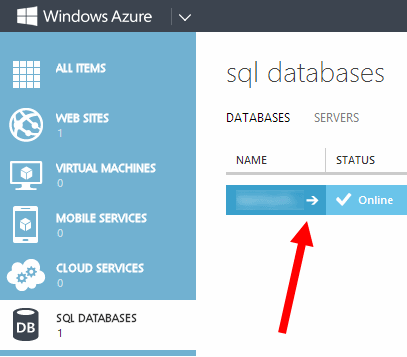
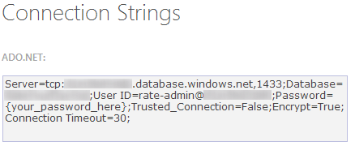

If you are writing a website that will be deployed to Windows Azure, or indeed you are using SQL Azure as the backend for some other endeavour, chances are you will want to connect to that database with a management tool and query its data. You can achieve this in one of two ways; using Visual Studio or using SQL Server Management Studio. Using Visual Studio is fine, but I have been using SQL Server Management Studio for many years and I have grown accustomed to it, so it is my preferred tool. There are a couple of steps you need to take to make this work.

### Obtaining the connection information

Both approaches require connection information and updates to the Windows Azure firewall rules, so we'll do this first. Go to [WindowsAzure.com](http://www.windowsazure.com/en-us/account/) and log in to the Management Portal. Select your SQL database and click the small arrow next to the name of your database (shown below).



Under the **Connect to your database** header, click **SQL Database connection strings for ADO .Net, ODBC, PHP and JDBC**.



Next, you need to update the Windows Azure firewall rules to allow access to your database.

Switch back to the Windows Azure Management Portal, and under the **Design your SQL database** header, click **Set up Windows Azure firewall rules for this IP address**. Doing this will add a firewall exception, so you should be able to connect now using external tools.

### Connecting using Visual Studio

To do this, first you should download and install the [Windows Azure SDK](http://go.microsoft.com/fwlink/p/?LinkId=212999) and the [Windows Azure Tools for Microsoft Visual Studio](http://go.microsoft.com/fwlink/p/?LinkId=212999).


Open Visual Studio, and open the **Server Explorer** (View > Server Explorer). You will have a node for existing **Data Connections**. Right click and click **Add Connection**, the **Add Connection** dialog will open. Change the **Data Source** to **Microsoft SQL Server** and click **OK**. Enter the Server Name (the **Server** part of the connection string) and change the authentication mode to **Use SQL Server Authentication**. Enter the username and password you created when you set up your database. Under **Select or enter a database name**, select your database. Click **Test Connection** and then click **OK**. If you get a connection failure error message, ensure that you have added the Windows Azure firewall rule as discussed in the previous step. Close the dialog, you can now use the **Server Explorer** to query your data, add new tables and stored procedures etc.

### Connecting using SQL Server Management Studio (SSMS)

Open up SSMS and enter the connection information you retrieved from the Windows Azure Management Portal as discussed in the first step of this guide.


Click **Connect.** If you get a connection failure error message, ensure that you have added the Windows Azure firewall rule as discussed in the first step.

### Aside

You probably will only want to connect to your SQL Azure database when you are ready to deploy your application. I highly recommend updating the connection strings in your **Web.config** to point to a local SQL Server instance. Open your **Web.config** and update your connection strings to point at a local instance, as follows;

```xml
<connectionStrings>
	<addname="DefaultConnection" connectionString="Server=.;Database=NameOfYourDatabase;Trusted_Connection=True;"
  providerName="System.Data.SqlClient" />
</connectionStrings>
```

Now, open **Web.Release.config** and add an XML Document Transform (XDT) to update the connection string to point at Windows Azure when the application is running in release mode;

```xml
<connectionStrings>
	<addname="DefaultConnection" connectionString="Server=.;Database=NameOfYourDatabase;Trusted_Connection=True;"
  providerName="System.Data.SqlClient" />
</connectionStrings>
```

### Summary

You can easily use Visual Studio or SQL Server Management Studio to manage your SQL Azure databases. You can also add a simple XDT to switch your connection strings depending on the build configuration.
