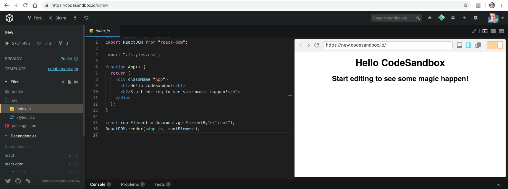

This post explores 3 separate ways to get a React application up and running quickly.

## TL;DR

To get start quickly with React, you have three choices;

- [CodeSandbox](https://codesandbox.io/s/new)
- [Create React App](https://reactjs.org/docs/create-a-new-react-app.html)
- [Parcel.js](/parcel.js/build-a-react-web-app-with-parcel/)

## How to get started with React using CodeSandbox

CodeSandbox is one of the most useful tools on the web today. CodeSandbox enables you to forget all about the complexities of setting up a development environment and enables you to _just start coding_. CodeSandbox is truly a breath of fresh air and a pleasure to work with.

You can create a new CodeSandbox by following this link; [New React CodeSandbox](https://codesandbox.io/s/new)



No configuration is needed here, you can make changes to the code and see those changes immediately in the preview on the right.

### Pros of CodeSandbox

- Very quick and easy to get started, no configuration needed
- Full syntax highlighting, intellisense (autocomplete), and console for detailed feedback messages
- Has a built-in test runner so we can write unit tests and run them right in the browser
- Good integration with GitHub so we can move away from GitHub

### Cons of CodeSandbox

- Best for small projects

## How to get started with React using Create-React-App

Create-React-App is the de facto standard for new developers getting started with React. Create-React-App is best initialised using the CLI, so Node.js and some basic knowledge of how to use the terminal is required.

Create-React-App comes with MANY features out of the box, including;

- React, JSX, ES6, TypeScript and Flow support (as well as many additional plugins that enable you to use newer syntax)
- Autoprefixing for CSS
- Unit test runner
- Development server with hot module reloading (HMR)
- Production build scripts
- Service worker for offline support

To create a new Create-React-App, run the following commands in your terminal;

```shell
npx create-react-app my-app
cd my-app
npm start
```

Now you can browse to `http://localhost:3000` and see the site. Open the code in your favourite editor and you will see that any changes you make are immediately displayed in the browser (it updates every time you save!).


### Pros of Create-React-App

- Very fast and easy to get started
- Has a broad range of functionality out-of-the-box
- Is production ready

### Cons of Create-React-App

- Has a broad range of functionality out-of-the-box, can be complex
- Almost always refers to `yarn` instead of `npm`. Most people do not have `yarn` and would have to know to install in separately, or that `npm` can usually be used in its place
- All the configuration is "brushed under the rug" and you have to irreversibly "eject" the code to be able to make configuration changes

## How to get started with React using Parcel.js

Parcel.js is the new kid on the block, and is a Webpack competitor. Parcel.js takes your code, analyses it and builds it automatically, no configuration needed. I have a more [comprehensive Parcel.js tutorial](/parcel.js/build-a-react-web-app-with-parcel/), but this is what you need to know;

- You create your `index.html` file, `index.js` file and link the two using a `script` tag.
- Then add your React code to `index.js` in the same way that CodeSandbox does
- From your terminal, you call `npm run parcel ./index.html` and your code will be built and hosted in the browser automatically. That is it!

### Pros of Parcel.js

- Fast, lightweight
- No configuration
- Is production ready

### Cons of Parcel.js

- Whilst Parcel itself is configuration free, other tools such as Babel require some configuration
- Less widely used than other tools like Webpack

## Summary

Thankfully there are several ways, with varying degrees of difficultly, to get started with React quickly. CodeSandbox is the quickest and easiest choice, as it "just works" right in the browser. Create React App is a fantastic starting point with a rich feature set out of the box. Rolling your own project from scratch using a build tool like Parcel.js is also very powerful, whilst requiring more setup.
