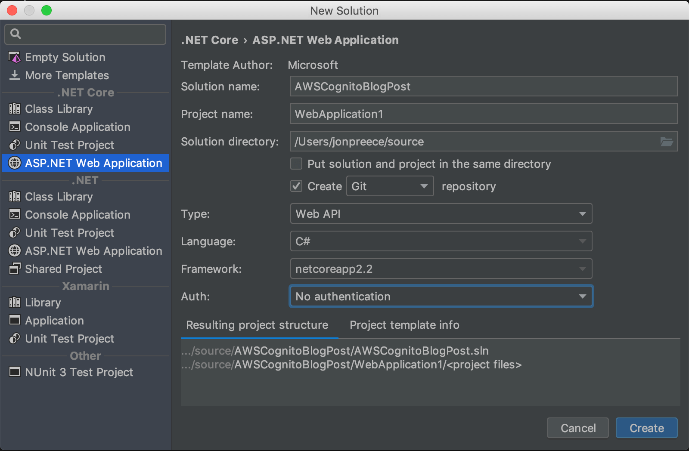
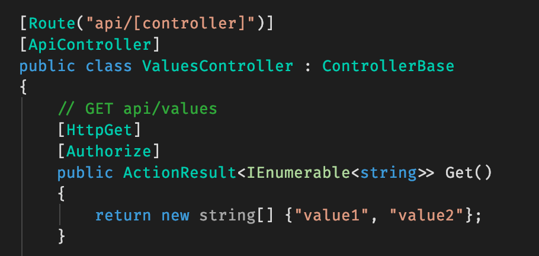
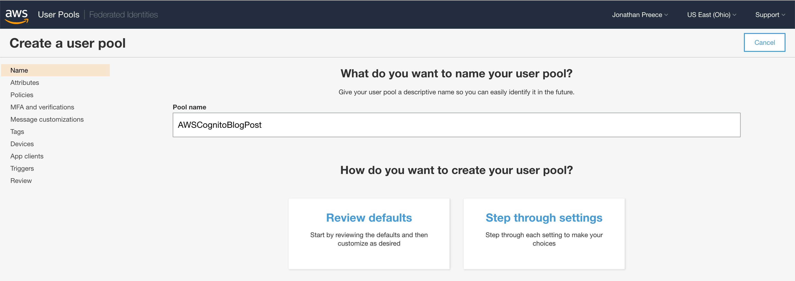
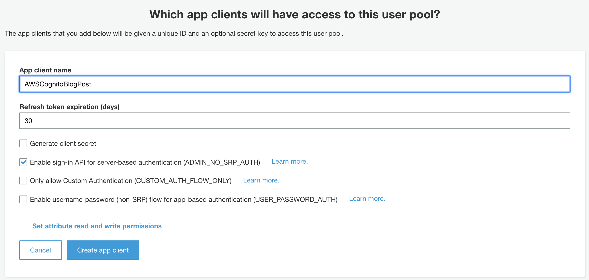
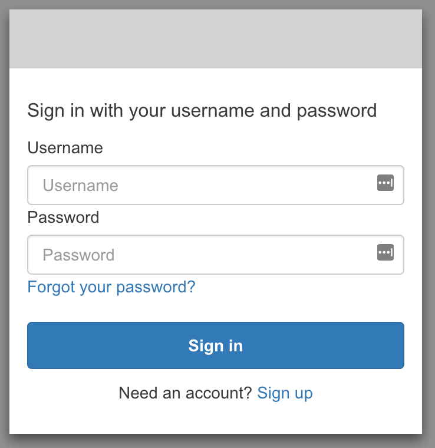

I never would have believed just a couple of years ago that I would be typing these words. With just a few lines of code you can add authentication and authorisation to your cross platform .NET web application in a secure way using Amazon Web Services (AWS) Cognito API. You can either call the API directly with `POST` requests, or take advantage of the built in user interface. As an added bonus, Cognito supports federated identities, allowing you to use external identity providers such as Google and Facebook to enable users to log in to your application quickly without having to enter a username or password.

This post will focus specifically on authentication, and a follow-up post will cover authorization. We assume that you already have an AWS account.

We have used Jetbrains Rider on a Macbook Pro, although you could use Visual Studio on Windows instead.

A list of specific versions of each library used can be found at the end of this post.

## Project Setup

Start by creating a new .NET Core Web API application as shown.



You could alternatively run the following command from the command line to achieve the same;

```shell
dotnet new webapi
```

With the project scaffolded, run it and open the browser to `https://localhost:5001/api/values`, you should see a basic JSON response with a couple of values (ignore and bypass any security certificate errors);


### Secured route

To prove that the user is authenticated, we will secure this route and make it accessible only to users who have logged in.

To secure a route, add the `Authorize` attribute to the `Get` method in `ValuesController` as shown.



If you re-run and refresh the browser you will likely see an error message about missing `authenticationScheme`. No problem we will fix this and revisit later.

**Note**: If you try and hit an endpoint that does not require authentication (such as `https://localhost:5001/api/values/5`), the request will still resolve and a value will be displayed.

## Cognito Setup

Head over to the AWS Cognito dashboard and verify you are in the correct region (we will use `us-east-2` for this tutorial). Click **Manage User Pools** and click **Create a user pool**. A user pool is simply a user directory that enable users to sign in to your mobile or web app via Cognito. Give your pool a name, such as `AWSCognitoBlogPost`.



Click **Review Defaults** and then click **Create Pool** to create your user pool. Your pool should now be created.

### App Client

Next, we must define an app client, which can access the user pool.

Select **App Clients** from the **General Settings** menu on the left.



Give your app client a name and ensure that **Generate client secret** is not selected. Finally, ensure that **Enable sign-in API for server-based authentication (ADMIN_NO_SRP_AUTH)** is selected and click **Create app client**.


When done, you should have an **App Client Id** as shown in the screenshot above. Keep note of this as we will need it later.

## Application Integration

When authentication is challenged, OpenId will redirect the browser to Cognito so the user can enter their credentials. When they are successfully authenticated, the user will be redirected back to your application. We need to tell Cognito where to redirect back to exactly.

Click **App Client Settings** under **App Integration** and set the URL to `https://localhost:5001/signin-oidc`;


Also note, you should enable `Authorization code grant` and select `email openid profile` from OAuth scopes. Click **Save Changes** to save back to Cognito.

## Amazon Cognito Domain

We will use the user interface provided by Cognito to sign up users and enable them to log in. If you plan to build your own UI, this is possible and this step can be skipped. Note that building a custom UI is out of the scope of this blog post.

Open **Domain Name** under **App Integration** and enter a domain prefix.

Once done, click **Save Changes**.

## OpenId Connect

Now that we have configured our application Cognito, we need to configure .NET Core to be able to utilise it.

Open `Startup.cs` and add the following references;

```csharp
using Microsoft.AspNetCore.Authentication.Cookies;
using Microsoft.AspNetCore.Authentication.OpenIdConnect;
```

then update the `ConfigureServices` method as follows;

```csharp
public void ConfigureServices(IServiceCollection services)
{
    services.AddMvc().SetCompatibilityVersion(CompatibilityVersion.Version_2_2);

    services.AddAuthentication(options =>
        {
            options.DefaultAuthenticateScheme = CookieAuthenticationDefaults.AuthenticationScheme;
            options.DefaultSignInScheme = CookieAuthenticationDefaults.AuthenticationScheme;
            options.DefaultChallengeScheme = OpenIdConnectDefaults.AuthenticationScheme;
        })
        .AddCookie()
        .AddOpenIdConnect(options =>
        {
            options.ResponseType = Configuration["Authentication:Cognito:ResponseType"];
            options.MetadataAddress = Configuration["Authentication:Cognito:MetadataAddress"];
            options.ClientId = Configuration["Authentication:Cognito:ClientId"];
        });
}
```

There are a few things of note going on here;

- Enable authentication using the `AddAuthentication` middleware
- Set the default authentication scheme and default sign in scheme to **Cookies** (`CookieAuthenticationDefaults.AuthenticationScheme`)
- Use cookies as stipuated for the default authentication and sign in schemes (`AddCookie`)
- Set the default challenge scheme to **OpenIdConnect** (`OpenIdConnectDefaults.AuthenticationScheme`)
- Set the response type to `code`, this is what we will receive back from Cognito
- Set the client Id, which is the Id we created earlier in Cognito (App Client Id)

## Authentication middleware

Next, you should now add the authentication middleware to the request pipeline.

Your `Configure` method should look as follows;

```csharp
public void Configure(IApplicationBuilder app, IHostingEnvironment env)
{
    if (env.IsDevelopment())
    {
        app.UseDeveloperExceptionPage();
    }
    else
    {
        // The default HSTS value is 30 days. You may want to change this for production scenarios, see https://aka.ms/aspnetcore-hsts.
        app.UseHsts();
    }

    app.UseHttpsRedirection();
    app.UseAuthentication();
    app.UseMvc();
}
```

Look closely, `UseAuthentication` comes before `UseMvc`. Were you to not get these in the correct order then this probably will not work properly, if at all.

**Important**: Ensure that you add the middleware BEFORE the MVC middleware gets added or this will not work.

## Environment Variables

You may have noticed that we have used some environment variables in our `ConfigureServices` method above. Let's go configure them now.

Open **appsettings.json** and add the following variables;

```json
{
  "Logging": {
    "LogLevel": {
      "Default": "Warning"
    }
  },
  "AllowedHosts": "*",
  "Authentication": {
    "Cognito": {
      "ClientId": "<app client id from AWS Cognito>",
      "IncludeErrorDetails": true,
      "MetadataAddress": "https://cognito-idp.<your region>.amazonaws.com/<your pool id>/.well-known/openid-configuration",
      "RequireHttpsMetadata": false,
      "ResponseType": "code",
      "SaveToken": true,
      "TokenValidationParameters": {
        "ValidateIssuer": true
      }
    }
  }
}
```

There are a few placeholders in the example above;

- **app client id from AWS Cognito**: This is your app client id, which can be found by clicking **App Clients** under **General Settings**.
- **your region**: This is your data center region, for example; us-west-1
- **your pool id**: This is your pool id, this can be found in the Cognito dashboard by clicking **General Settings** under the title **Pool Id**.

Take a moment to ensure you have the correct values in the correct places.

## First test

Run your application now and head to `https://localhost:5001/api/values` and you should be redirected to the Cognito default user registration/log in form.



Go ahead and create yourself an account. Either confirm yourself using the verification code or using the Cognito dashboard. Once registered, you should be redirected to the `/api/values` endpoint and you should see a result output. This means you have been successfully authenticated.

## Federated identity providers

Cognito has fantastic built in support for federated identity providers, aka social logins.

To add support for logging in via your existing Google account, for example, do the following;

- Create a Google App and obtain a **Google app Id** and **App secret**. Follow [this tutorial from the offical AWS docs](https://docs.aws.amazon.com/cognito/latest/developerguide/google.html).
- Go to **Identity providers** under **Federation** in the Cognito dashboard and select **Google**.
- Enter your **Google app Id** and **App secret**.
- Enter `profile email openid` as the **Authorize scope**.
- Click **Enable Google** to finish.

As we have added a new identity provider, we need to enable it before we can use it. In the Cognito dashboard, under **App Integration** click **App client settings**. Tick **Google** and then **Save changes**.

To test, go back to your browser and go to `https://localhost:5001/api/values`. If you are already logged in, do this in an Incognito or Private Browsing tab instead.

Notice we now have a revised log in UI.


## Summary

We have seen that we can configure a .NET Core application to use OpenIdConnect, which enables us to integrate with AWS Cognito for authentication. As an additional bonus, we get an easy mechanism for adding federated identity providers, social logins, to make it easier for users to log in or register an account.
