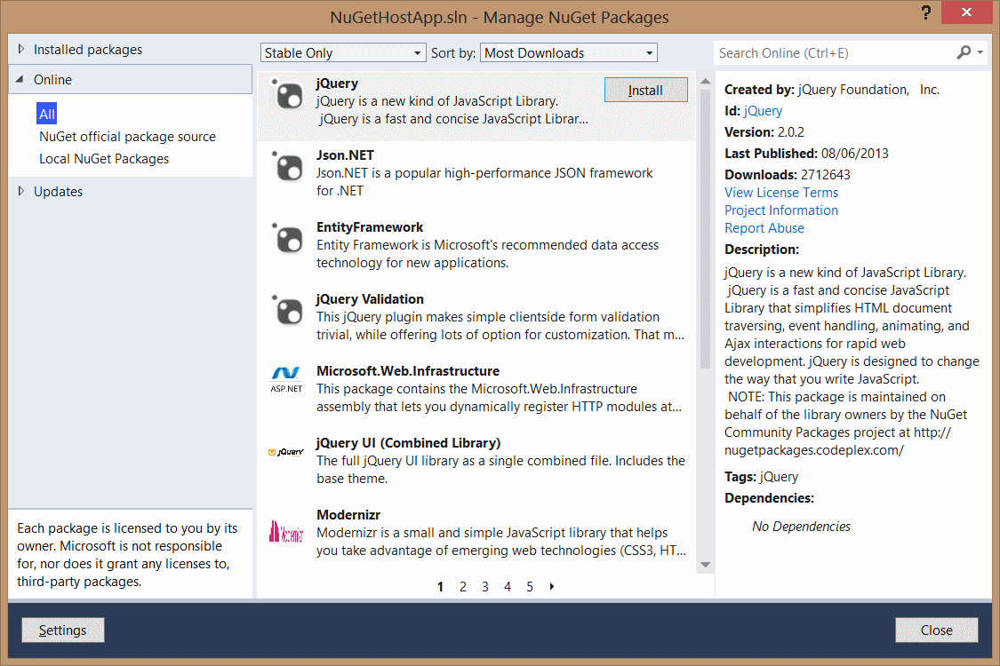
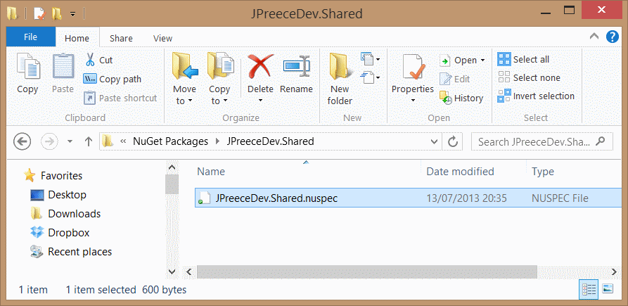
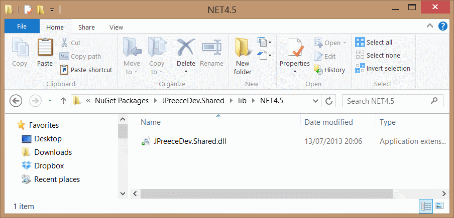
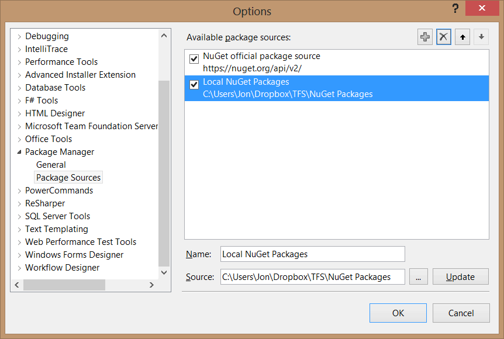
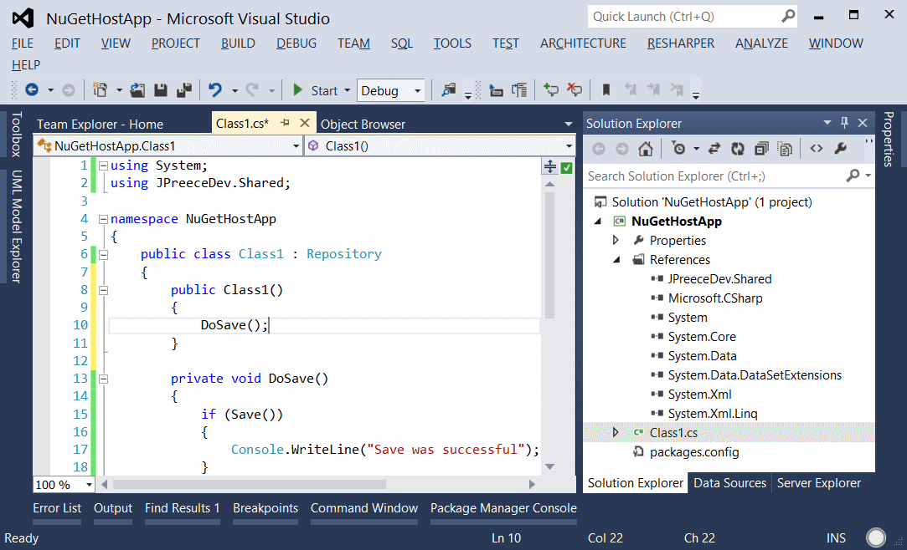
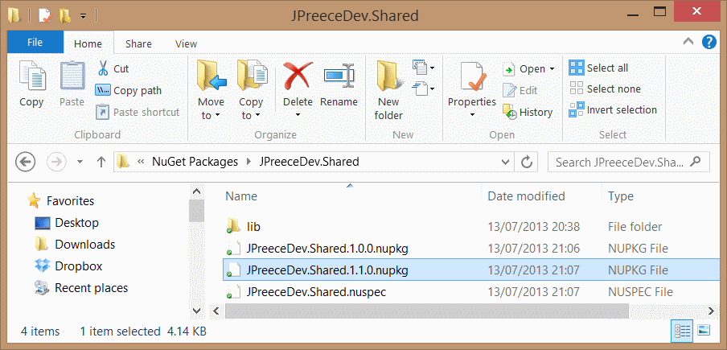
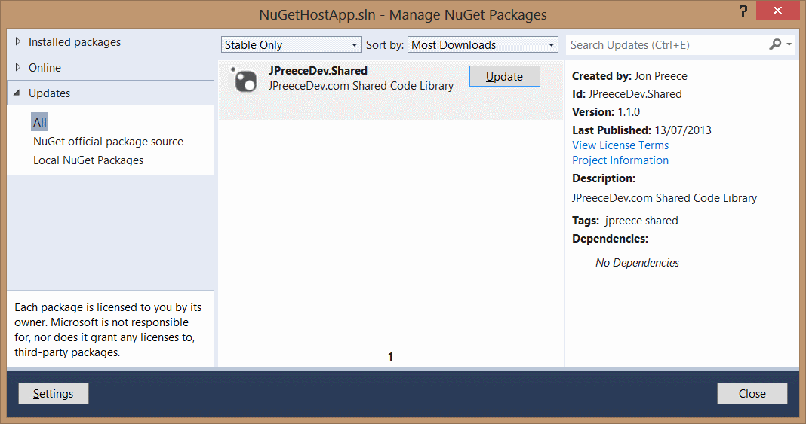

NuGet is a package manager tool for the .NET Framework. NuGet is free, open source, and is supported by Microsoft Visual Studio, as well as several other environments. NuGet allows you to add packages to your projects, either from the [public package gallery](http://nuget.org/ 'NuGet Package Gallery') or from your own private package gallery. The latter is, in my opinion at least, somewhat under-utilised and misunderstood in the business world. This post aims to try to shed some light on how NuGet can work for your company.

### Public Gallery

If you haven't used NuGet before, you really are missing a trick. NuGet allows you to extend the functionality of your application by adding third party code/tools to your projects. Most of the projects hosted on the NuGet public gallery are free (and yes, commercial free!), and open source. You can access NuGet in two ways, either visually using the Library Package Manager or through the Package Manager Console window. To open the Library Package Manager, click Tools > Library Package Manager > Manage NuGet Packages for Solution...



To install a package, simply click it and click Install. You can easily search for packages using the search field (top right). There are literally thousands of free packages.

### Private Galleries (A.K.A Private Repositories)

So what is a private NuGet gallery? A private NuGet gallery is a gallery which you host yourself. The gallery sits either on your local machine, or somewhere on your company network. There's actually nothing stopping you from hosting your own public gallery either. So what is the benefit of hosting your own private gallery? Well this is best answered with a scenario. Imagine you are developing multiple websites for various clients whereby they have a lot of common code. You don't want to duplicate your code, so you create a library and put the shared code inside the library. Each project would then have a reference back to the library. This is a very common scenario and is widespread. But what if your common code lives in another branch in your source code repository? What if each website has its own branch? Then every time you update your library you would need to manually merge the assembly into the other branches. NuGet greatly simplifies this process, as you would simply have to publish and update to your gallery and each website can choose weather or not to update. Some websites might not want to update, perhaps due to breaking changes. Each project can decide if it wants to update or not.

### Creating a NuGet package

Every good package starts with a good library. You probably already have a good idea of which libraries you want to turn into packages. For the sake of this demo, we will be working with a shared library called `JPreeceDev.Shared.dll`. This shared library consists of one class, called Repository, and one interface, called `IRepository`;

```csharp
public interface IRepository {
 bool Save();
}
public class Repository: IRepository {
 public bool Save() {
  return true;
 }
}
```

To create your package, first you'll need a little command line tool called [NuGet Command Line bootstrapper](http://nuget.codeplex.com/releases/view/58939 'NuGet Command Line Bootstrapper'). Once downloaded, you can either add an environment variable for it, or simply point to the full path when inside a command prompt window. At this stage, there are a few routes you could take, and this really depends on your preferences, internal processes, or source control set up. For the sake of simplicity, I will create a new directory at the same level as my project folder, called "NuGet Packages". Inside this folder I will create a sub folder called JPreeceDev.Shared, and inside there will live all the components for my NuGet package. You might want to; create a dedicated NuGet packages branch in your source control or add a new folder to your development branch specifically for NuGet packages. Open a command prompt, switch the working directory to the NuGet packages/your project folder and run the following command; `nuget spec` This will output a very generic Package.nuspec file, which consists of some simple XML. Open the file in your favourite text editor, and edit the XML with some appropriate information. Here is mine as an example;

```xml
<?xml version="1.0"?>
<package>
	<metadata>
		<id>JPreeceDev.Shared</id>
		<version>1.0.0</version>
		<authors>Jon Preece</authors>
		<owners>Jon Preece</owners>
		<licenseUrl>http://www.codeproject.com/info/cpol10.aspx</licenseUrl>
		<projectUrl>https://developerhandbook.com</projectUrl>
		<requireLicenseAcceptance>false</requireLicenseAcceptance>
		<description>developerhandbook.com Shared Code Library</description>
		<releaseNotes>First release.</releaseNotes>
		<copyright>Copyright Jon Preece 2013</copyright>
		<tags>jpreece shared</tags>
	</metadata>
</package>
```

I also like to rename the file so that it is more meaningful to my project. I will rename Package.nuspec to JPreeceDev.Shared.nuspec;



Now you need to bring in your library file. Start by creating a new folder called 'lib' at the same level as your nuspec file. Inside there you need to create another folder, which tells NuGet which version of the .NET Framework your library targets. In this case, the .NET Framework 4.5 is targeted by adding a folder called NET4.5;



Go ahead and drop your library into that folder. Next, return to the command prompt and run the following command; `nuget pack` This will output your NuGet package, with the file extension .nupkg. Your simple NuGet package is now complete and you are ready to tell NuGet about your private gallery.

### Adding your private gallery to the available package sources list

The next step is to tell NuGet about the private gallery you have just created. That way, when you later come to search for NuGet packages to add to your project, NuGet will know where to look. Open up Visual Studio, click Tools > Options > Package Manager > Package Tools. Click the "Add" button (top right), give your Package Source a name (in this case, Local NuGet Packages) and set the path back to the NuGet Packages folder you created earlier;



Click Update, then Ok to save the changes. Now fire up the project in which you want to consume the library, open up the Library Package Manager, and notice that your private gallery is now available under the 'Online' tab;


To add the package to your project, simply click Install, and accept the license agreement. Notice that the reference has now been added to your project, and the code within the library can be consumed as normal.



### Updating

So if you have been following along in Visual Studio, you may be thinking something along the lines of "this is a lot of effort, I'll just stick with my current process as this is what I am familiar with and I know it works". Well stick with me, because this is where NuGet really comes into its own... when updating packages. So lets say its been a while, and you have made some changes to your shared library. You're happy with your changes and are confident that your library is relatively bug free, so its time to push out an update to all the projects that consume the library. Fire up the NuSpec file (in this case, JPreeceDev.Shared.nuspec) and increment the build minor version number, and add some release comments. Now copy over your shared library DLL (JPreeceDev.Shared.dll) and fire up the command prompt. Run the NuGet pack command again; `NuGet pack` NuGet creates a new package, which is appended with the new version number;



Fire up your project again, and if you are not automatically prompted to update the package, open up the Library Package Manager and click on the 'Updates' tab.



As you can see, the update is now available for your project. Go ahead and click the Update button to complete the update. The updated assembly has now been added to your project. Easy eh?

### Advanced Topics

In this tutorial, we only visited how to create a simple NuGet package. There are more advanced features you can utilise to add additional functionality to your package;

- Run powershell scripts on both install/uninstall operations
- Add dependencies to the target project (for example, assembly references)

...and much more.

### Summary

NuGet is a package manager tools that allows us to easily add third part assemblies/tools to our projects. NuGet can also automatically or manually update those tools for us so that we always have the latest (or most appropriate) version added to our project. We can host our own NuGet packages in a private gallery and NuGet can serve them up to us in the way we would expect. This is particularly helpful in cases where we have code shared across multiple projects/branches where we don't want the pain of having to manually update the references to our shared code every time we make a change.
