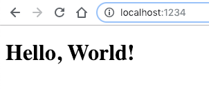
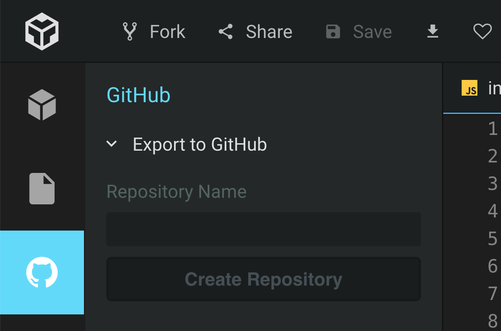
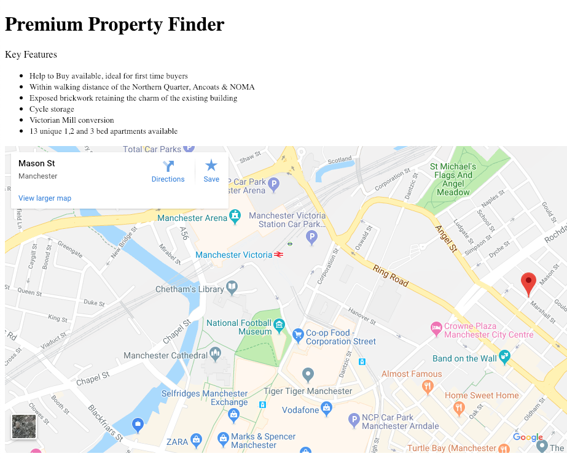

CodeSandbox is great for getting up and running quickly with no setup. However, CodeSandbox is not usually how I choose to bootstrap my projects and typically the companies I work for do not use an approach like this either (maybe they should, but that is a different post!).

You will find that a high percentage of companies today are using Webpack as their preferred front-end build tool. If you would like to learn more about Webpack, I have a comprehensive mini-series, starting with [Webpack 4 from absolute scratch](/webpack/webpack-4-from-absolute-scratch/).

I chose to use [Parcel.js](https://parceljs.org/) for my project for several reasons;

- It is crazy fast to get working for development purposes
- Is production ready
- Requires little to no configuration
- Just works

If you have not used Parcel.js before, this is a fantastic time to learn, so stick with me!

**Note for clarification as this is also a standalone post.** This post is part of a mini-series where we are building a real estate property listing website, complete with routing and advanced forms.

## Build a React app with Parcel.js from scratch

Remember, we are building a premium property listings website called **Premium Property Finder**, so let's get started.

Create a new folder called `premium-property-finder`, `cd` to it and run the following commands in your terminal;

```shell
npm init -y && git init
npm install --save react react-dom
npm install --save-dev @babel/core @babel/plugin-proposal-class-properties @babel/preset-env @babel/preset-react parcel-bundler
```

The commands initialise our project, source control, install React and some basic plugins we need for Babel, and of course, Parcel itself.

Add a `.gitignore` file and add the following (to keep our repository nice and clean);

```text
node_modules
.cache
dist
```

Then create a new directory called `src` and add a file called `index.html` as follows;

```html
<!DOCTYPE html>
<html lang="en">
  <head>
    <meta charset="UTF-8" />
    <meta name="viewport" content="width=device-width, initial-scale=1.0" />
    <meta http-equiv="X-UA-Compatible" content="ie=edge" />
    <title>Premium Property Finder</title>
  </head>
  <body>
    <h1>Hello, World!</h1>
    <div id="root"></div>
  </body>
</html>
```

Finally, add the following NPM script to your `package.json` file;

```json
"scripts": {
  "start": "parcel ./src/index.html"
}
```

Run `npm start` in your terminal and you are up and running.



Go to `http://localhost:1234` in your browser and you should see "Hello, World" as shown in the above screenshot. This is not React code, this is just static HTML. We will add the React code next.

## Add React to your Parcel.js web app

You might be surprised to know that we do not need to do anything particularly special to get React working in our web app.

Open `index.html` and add a `script` tag to `index.js` (we will create this next) as follows;

```html
<script src="index.js"></script>
```

Now create a new file called `index.js` and add the following;

```jsx
import React from 'react'
import ReactDOM from 'react-dom'

ReactDOM.render(<App />, document.getElementById('root'))
```

`<App />` is not defined yet, so let's do that. Flip back to your earlier CodeSandbox (you can find mine here; [Getting Started With React](https://codesandbox.io/s/x73lr1ojo4)) and copy the `App` function that we created.

Copy it and paste just before our call to `ReactDOM.render`, as follows;

```jsx
import React from 'react'
import ReactDOM from 'react-dom'

function App() {
  const features = [
    'Help to Buy available, ideal for first time buyers',
    'Within walking distance of the Northern Quarter, Ancoats & NOMA',
    'Exposed brickwork retaining the charm of the existing building',
    'Cycle storage',
    'Victorian Mill conversion',
    '13 unique 1,2 and 3 bed apartments available'
  ]
  return (
    <div className="App">
      <h1>Premium Property Finder</h1>
      {/*<KeyFeatures features={features} />
      <Map />*/}
    </div>
  )
}

ReactDOM.render(<App />, document.getElementById('root'))
```

Notice that we have to comment out `<KeyFeatures />` and `<Map />` at this time, as we have not migrated those files over yet (we will do that next).

Save changes, and refresh the browser, you should now see two titles, **Hello, World!** and **Premium Property Finder**. This confirms that React is working properly. Feel free to go delete the **Hello, World!** header text from `index.html`.

## How to migrate your code from CodeSandbox

There are a few ways to approach migrating your code from CodeSandbox.

### Good old-fashioned copy and paste

When you are working with a small number of files, the quickest way is to simply copy your changes and manually re-create the files in your local editor. Once you have 5-6-7+ files, this will become tiresome.

### Download files directly from CodeSandbox

CodeSandbox has a super handy download button on the menu bar in the top left-hand corner.


Click this button to download all the files and folders from CodeSandbox to a ZIP file. Extract the ZIP file and copy the files into your project.

### Save your project directly to GitHub

Click the GitHub icon on the left hand menu bar, and sign in with your GitHub account.



Give the project a name and click **Create Repository**. You could now download the repo from GitHub in the normal way.

Please go ahead and migrate your `<KeyFeatures />` and `<Map />` components, as their associated CSS files.

When done, head over to the root `index.js` and uncomment the aforementioned components.

Add the following imports to the top of the file.

```javascript
import Map from './components/map/'
import KeyFeatures from './components/keyFeatures/'
```

Assuming all is well, the app should now be running in the browser, almost the same as when we were using CodeSandbox.



You may notice that the font does not match what we had before. This is because CodeSandbox sets the default font to `sans-serif`. We will be using a CSS framework, called [Spectre](https://picturepan2.github.io/spectre/) which will help us out with fonts later so we do not need to worry about this now.

## How to enable support for CSS modules

To ensure feature parity with CodeSandbox, we need to add support for CSS modules. Parcel.js does not support CSS modules out-of-the-box, so we need to use a plugin.

### PostCSS Modules

As Parcel.js has built in support for PostCSS, enabling CSS modules using that will be simplest and quickest.

First, install `postcss-modules` as follows;

```shell
npm install --save-dev postcss-modules
```

Now, to enable it, create a new file in `src/components` called `.postcssrc`, and add the following;

```json
{
  "modules": true
}
```

Your project now has full support for CSS modules.

## Summary

CodeSandbox served us well for getting our project up and running quickly, but now that our application is growing we want to "take it offline" and use our own build tool, ParcelJS. We discussed some ways of migrating from CodeSandbox, and how to set up Parcel.js, and then we completed the migration.

Next, we will start getting seriously deep into building out our application, so stay tuned!
