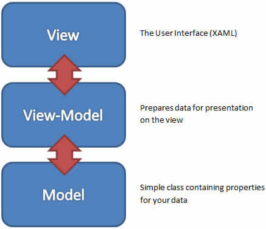

The purpose of this series of tutorials is to introduce the WPF MVVM (Model-View-ViewModel) design pattern, and look at how to quickly and simply implement it in a Windows Presentation Foundation (WPF) application. This series is targeted at developers of all levels, but especially at developers who are looking to make the transition from Windows Forms to WPF. The first part of this series will focus on;

- What exactly is MVVM, and why should I care?
- What problem does the MVVM design pattern attempt to solve?

Subsequent posts will attempt to;

- Demonstrate how to quickly implement the MVVM pattern in a new WPF application.
- Discuss data binding, change notifications, events and commands.
- Discuss some techniques for converting older WinForms applications to WPF.
- Discuss and see how to create user controls/custom controls without breaking the MVVM pattern.

### So what is Model-View-ViewModel (MVVM)?

From a high level, [MVVM is a design pattern](http://en.wikipedia.org/wiki/MVVM 'Model-View-ViewModel'). MVVM provides a way for you to structure your code in a way that promotes maintainability, reusability and scalability. This is primarily achieved by separating code into focused sections, a technique known as [Separation of Concerns](http://en.wikipedia.org/wiki/Separation_of_concerns 'Separation of Concerns') (S0C). Separation of Concerns is the idea that your business logic, view (UI) specific logic and data access code should be decoupled from each other. For example; the view should not know anything about how data is retrieved from an external data source... likewise in the case of N-tier architecture (client/server) applications, the server side code should know nothing of how data that has been retrieved is going to be visually represented to the user.

The above is certainly an oversimplification, but it shows how the different entities interact with each other. The model class is populated from an external data source, typically a relational database (such as SQL Server or Oracle Database). The model is wrapped by the view-model, which prepares the data for presentation to the view. The view-model also handles passing the data back to the model class in the event that the data has changed (i.e. the user edited a value using a text box on the UI). The view presents the data to the user.

### Maintainability, Reusability and Scalability

MVVM really comes into its own in large (typically Enterprise) applications where many developers are working on a single product. However, MVVM is quick and simple to implement and can be beneficial to even the smallest and simplest of applications...especially those that will grow and evolve over time. As MVVM provides a consistent approach to writing and structuring code... additional developers can come in and start working on specific areas/modules without having to learn the intricate architectural details (and quirks! :)).

### Summary

In short, MVVM is a design pattern that can help small applications grow into large applications by providing consistency. Consistency makes code more maintainable by a team of developers that my increase in numbers over time. In the next part of the series, we will look at how we go about creating a very simple WPF application with the MVVM design pattern and we will look at what role data binding plays in making this possible.
